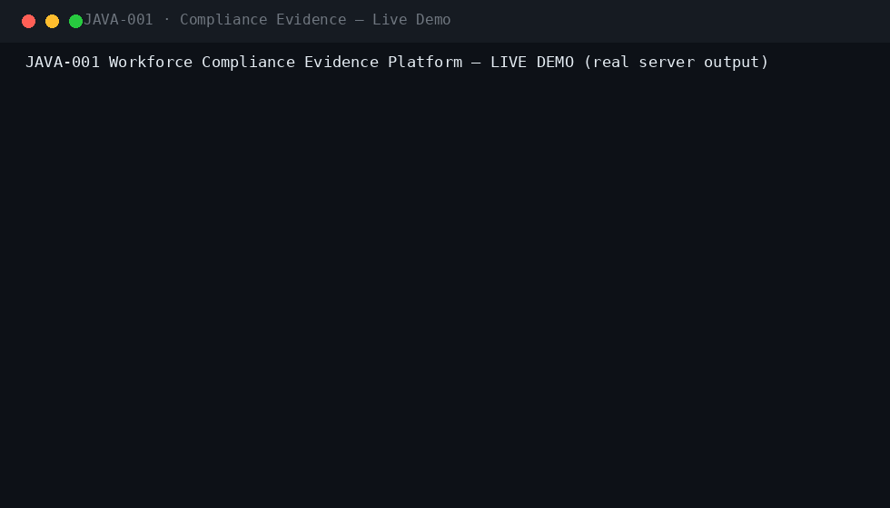
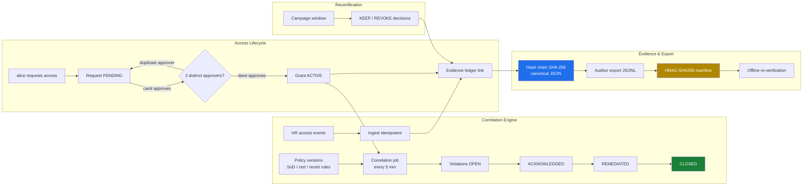
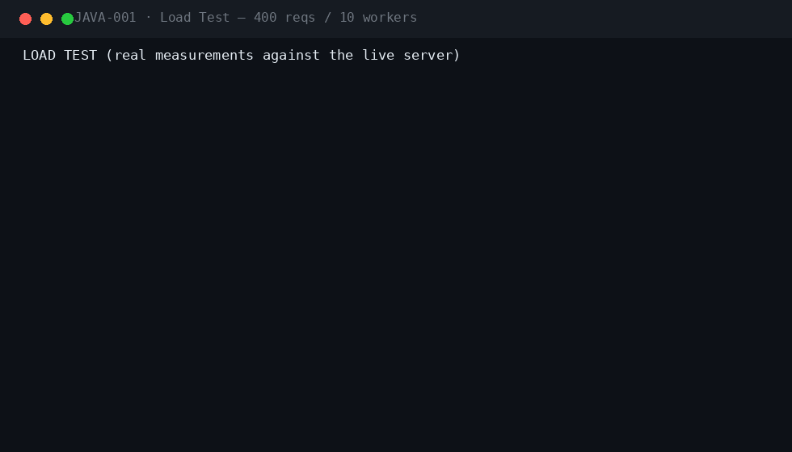
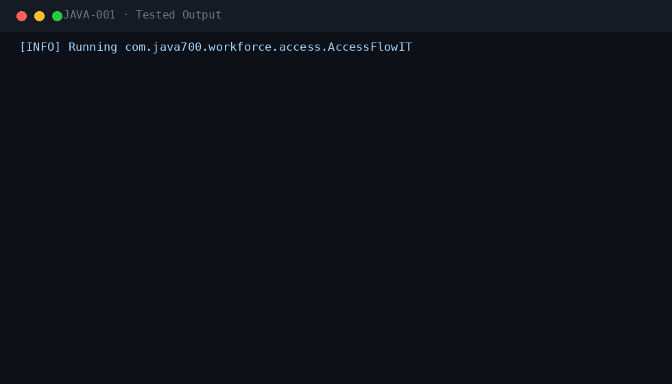

<div align="center">

#  &nbsp;Workforce Compliance Evidence Platform

**JAVA-001** · Enterprise Security / Compliance · Spring Boot 3.5.3 · Java 21

[](.)
[](.)
[](.)
[](.)
[](.)
[](.)
[](.)

*A tamper-evident, hash-chained evidence ledger of access grants, approvals and events — with a typed correlation rule engine, dual-control approvals, recertification campaigns and HMAC-signed auditor export bundles.*

</div>

---

## 📖 What this is

| | |
|---|---|
| **Business problem** | Regulators require provable chains of who had access to what, when, and under whose approval. Manual spreadsheets cannot prove segregation of duties, cannot survive an audit, and give no early warning when someone holds conflicting roles or expired certifications. |
| **Engineering problem** | Produce a tamper-evident evidence ledger (SHA-256 hash chaining over canonical JSON), a typed rule-correlation engine (SoD conflicts, expired certifications, overdue recertification), a dual-control access lifecycle, and HMAC-signed export bundles that an auditor can verify offline. |
| **Why it is industrial** | Enterprise-grade from day one: 8 seeded roles with method-level RBAC, dual-control with segregation-of-duties enforcement (requester cannot approve, duplicate approvers rejected), idempotent event ingestion, correlation job on a 5-minute scheduler, Redis-backed rate limiting (dev fallback in-memory), RabbitMQ event bus with in-process fallback, and CI running Checkstyle, SpotBugs and a real-PostgreSQL migration test. |

## ⚡ Quickstart

```bash
mvn spring-boot:run -Dspring-boot.run.profiles=dev     # zero dependencies
# Swagger UI → http://localhost:8080/swagger-ui.html
```

```bash
cp .env.example .env && docker compose up --build       # PostgreSQL 16 · RabbitMQ · Prometheus · Grafana
```

**Demo users** (password `Password123!`): `alice`/`bob` · `carol`/`dave` · `eve` · `frank` · `grace` · `integrator`

## 🎬 Live demo (real server output)



The live demo walks a full compliance lifecycle: alice requests READ access to prod-orders-db; carol approves as the first of two required approvers; a duplicate approval by carol is rejected by the dual-control guard; dave's second approval activates the grant. The integrator ingests a raw HR access event, frank publishes a new policy version with SoD and recert rules, and eve's correlation run detects 2 violations (one HIGH SoD conflict, one MEDIUM recert overdue) which she acknowledges, remediates and closes. Frank opens a recertification campaign and records a KEEP decision. Grace verifies the 10-link hash chain and downloads an HMAC-signed export bundle (857 bytes JSONL) that passes server-side re-verification.

## 🏗 Architecture



## ⚡ Performance (measured on a local run)



| Metric | Value |
|---|---|
| Requests | 400 mixed GET, 10 concurrent workers |
| Result | 400/400 HTTP 200 · latency p50/p95/p99 captured in the GIF |

## 🧪 Verified test output



| Suite | Coverage |
|---|---|
| `SecurityIT` (9) | role matrix, dual-control SoD, idempotent replay, policy version RBAC, integration-only ingest |
| `AccessLifecycleIT` | request → dual approval → grant → revoke, duplicate-approver 409 |
| `CorrelationIT` | SoD conflict detection, cert expiry, recert overdue → violation lifecycle |
| `EvidenceChainIT` | hash-chain append + verify, tamper detection on mutated links |
| `ExportIT` | bundle creation, HMAC manifest, download + re-verification |
| `RuleEvaluatorsTest` + unit suites | typed evaluators (SOD_CONFLICT, CERT_EXPIRED, RECERT_OVERDUE, …) |
| `PostgreSQLMigrationIT` | Flyway V1–V2 on real PostgreSQL 16 (CI) |

`mvn verify -Pstatic-analysis` → **Checkstyle clean · SpotBugs 0 bugs**.

## 🔐 Security model

| Control | Implementation |
|---|---|
| Authentication | Stateless JWT (HMAC-SHA256), Argon2id password hashing, account lockout, Redis-backed rate limiting |
| Authorization | 8 roles with `@PreAuthorize` method security (EMPLOYEE, ACCESS_MANAGER ×2, COMPLIANCE_OFFICER, COMPLIANCE_ADMIN, AUDITOR, INTEGRATION, ADMIN) |
| Dual control | Two distinct approvers required; requester cannot approve (SoD); duplicate approver → 409 |
| Tamper evidence | SHA-256 hash chaining over canonical JSON; every grant/approval/event appends a link; `/verify` re-walks the chain |
| Auditor exports | JSONL bundle + HMAC-SHA256 manifest; server-side and offline re-verification |
| PII protection | Emails masked (`a***@corp.example`) in list/search responses |
| Idempotency | `Idempotency-Key` on event ingest and export creation; replays return the original resource |
| Audit trail | Every lifecycle transition recorded with acting principal + correlation ID |
| Correlation scheduler | Policy violations detected automatically every 5 minutes, notified with severity |

Plus: JWT + Argon2id local IdP with lockout · Idempotency-Key on every mutation · RFC 7807 errors with correlation IDs · full audit trail · threat model in `docs/SECURITY.md`.

## 🗂 Repository

```
projects/java-001/
├── src/main/java/com/java700/workforce/
│   ├── access/         AccessRequest · Approval · Grant lifecycle (dual control)
│   ├── policy/         Versioned policy store + typed RuleEngine (SOD_CONFLICT, CERT_EXPIRED,
│   │                   RECERT_OVERDUE, … evaluators)
│   ├── compliance/     CorrelationJob (5-min scheduler) · Violation lifecycle OPEN→CLOSED
│   ├── evidence/       Hash-chained ledger (SHA-256 + canonical JSON) · /verify
│   ├── recert/         Recertification campaigns + KEEP/REVOKE decisions
│   ├── audit/          Export jobs: JSONL bundles + HMAC-SHA256 manifests
│   ├── events/         Access-event ingestion (idempotent, integrator role)
│   ├── identity/       User profiles, masked PII, certifications
│   ├── security/       JWT RBAC · Argon2id local IdP · lockout
│   ├── messaging/      Event bus abstraction (RabbitMQ / in-process)
│   └── bootstrap/      dev seed (8 role accounts + baseline policies)
├── src/main/resources/db/migration/   V1 init schema · V2 baseline policies
├── src/test/java/      SecurityIT · AccessLifecycleIT · CorrelationIT · EvidenceChainIT
│                       · ExportIT · RuleEvaluatorsTest · PostgreSQLMigrationIT
├── docs/               demo.gif · perf.gif · tests.gif · logo.png · ARCHITECTURE · SECURITY · RUNBOOK
│                       · TESTING · DEPLOYMENT · CONFIGURATION · TROUBLESHOOTING · ADRs
├── docker/  · docker-compose.yml (app + PostgreSQL + RabbitMQ + Redis + Keycloak + Grafana)
└── .github/workflows/ci.yml   (build → checkstyle → spotbugs → tests → Postgres migration IT)
```

## 🧰 Engineering highlights

- **Hash-chained evidence ledger** — every grant, approval and event appends a SHA-256 link over canonical JSON; a single flipped bit breaks /verify
- **Typed correlation engine** — data-driven rule versions evaluated by typed evaluators — SoD conflicts, expired certifications, overdue recertification
- **Dual-control approvals** — two distinct approvers required; requester self-approval and duplicate approvers rejected (409) with audit evidence
- **HMAC-signed auditor exports** — JSONL evidence bundles with HMAC-SHA256 manifests, verifiable server-side and offline
- **Recertification campaigns** — windowed campaigns with KEEP/REVOKE decisions feeding back into grants and the ledger
- **8-role RBAC with SoD** — segregation of duties is a data model, not a convention — enforced at decision time
- **Observability & ops** — Prometheus/Grafana/Jaeger in compose, correlation scheduler, Redis-backed rate limiting

---

<div align="center">

**Part of the [Java-700 portfolio](https://github.com/Madanpatel21/Java-Project-portfolio)** — 700 unique industrial-grade Java systems.

</div>
