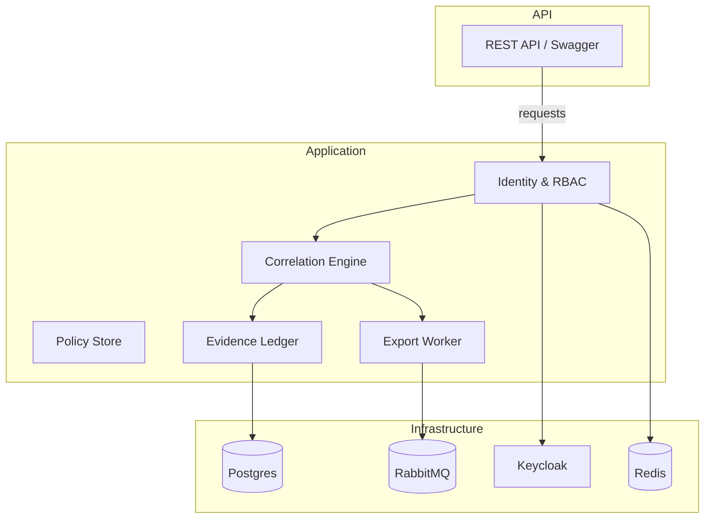
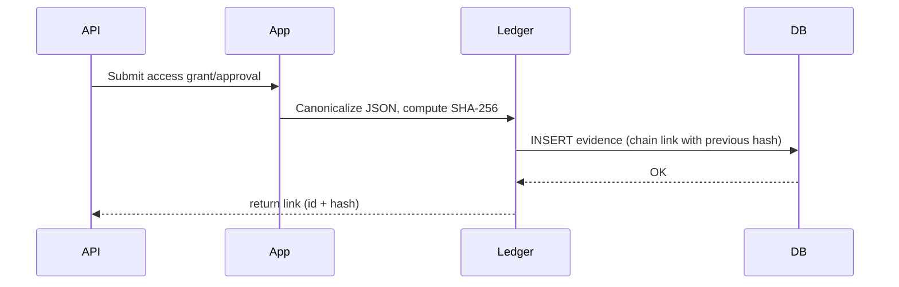
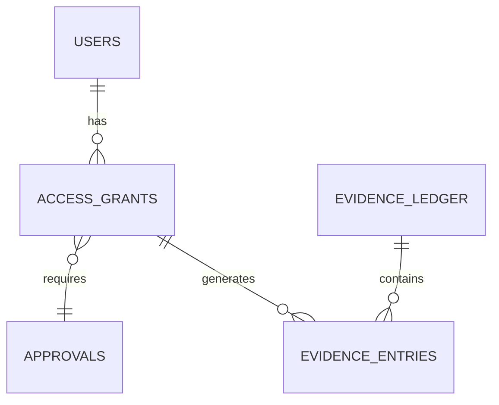

<p align="center">
  
</p>

<p align="center">
  <h1>JAVA-001 — Workforce Compliance Evidence Platform</h1>
  <em>Hash‑chained evidence ledger, typed rule correlation, and HMAC‑signed auditor exports for enterprise access compliance.</em>
</p>

<p align="center">
  
  
  
  
</p>

## What it is — in one line

A production‑grade Spring Boot application that produces a tamper‑evident, hash‑chained evidence ledger of access grants, approvals and events, detects compliance violations with a typed rule engine, runs recertification campaigns and generates HMAC‑signed auditor export bundles.

Why this matters

- Regulators require provable chains of who had access to what, when, and under whose approval. This project makes that chain auditable and tamper‑evident.
- Built for enterprise constraints: enforced dual control, segregation of duties, exportable auditor bundles, and operational observability.


## Quick highlights

- Hash‑chained evidence ledger (SHA‑256 + canonical JSON)
- Typed correlation engine with prebuilt rule evaluators (5 evaluators)
- Violation lifecycle: OPEN → ACKNOWLEDGED → REMEDIATED → CLOSED
- Auditor exports: JSONL + manifest + HMAC‑SHA256
- Dev-first zero‑dependency quickstart; local profile for production‑like stack via Docker Compose


## Technology snapshot

| Area | Technology |
|---|---:|
| Language | Java 21 |
| Framework | Spring Boot 3.5 (virtual threads optimized) |
| Persistence | PostgreSQL (H2 dev mode for quickstart) |
| Messaging | RabbitMQ (local profile), in‑process dispatch (dev) |
| Identity | Local IdP (Argon2id) or Keycloak (OIDC in local profile) |
| Observability | Prometheus, Grafana, Jaeger, Spring Actuator |


## Architecture (short)

Modular monolith (packages map to bounded contexts). Core modules: identity & RBAC, versioned policy store, access lifecycle with dual control, correlation engine, evidence ledger, recertification engine, and auditor export subsystem. Events flow over a bus abstraction (RabbitMQ in local, in‑process in dev). See docs/ARCHITECTURE.md for full detail.


### System architecture




### Evidence write/read sequence




## Quickstart — zero dependencies (dev)

```bash
# Prerequisite: JDK 21+ and Maven 3.9+
mvn spring-boot:run -Dspring-boot.run.profiles=dev
# or
mvn -DskipTests package && java -jar target/workforce-compliance-1.0.0.jar --spring.profiles.active=dev
```

- Swagger UI: http://localhost:8080/swagger-ui.html
- Actuator health: http://localhost:8080/actuator/health
- Prometheus: http://localhost:8080/actuator/prometheus

<details>
<summary>Demo credentials (dev seed)</summary>

| User | Role | Password |
|---|---|---|
| alice / bob | EMPLOYEE | `Password123!` |
| carol / dave | ACCESS_MANAGER (dual-control pair) | `Password123!` |
| eve | COMPLIANCE_OFFICER | `Password123!` |
| frank | COMPLIANCE_ADMIN | `Password123!` |
| grace | AUDITOR (read-only) | `Password123!` |
| integrator | INTEGRATION | `Password123!` |

Example: get a token and run correlation

```bash
TOKEN=$(curl -s -X POST http://localhost:8080/api/v1/auth/token \
  -H "Content-Type: application/json" \
  -d '{"username":"frank","password":"Password123!"}' | jq -r .accessToken)

# trigger correlation → expect 5 violations seeded for alice
curl -s -X POST http://localhost:8080/api/v1/compliance/run -H "Authorization: Bearer $TOKEN" | jq
curl -s http://localhost:8080/api/v1/violations -H "Authorization: Bearer $TOKEN" | jq
curl -s http://localhost:8080/api/v1/evidence/verify -H "Authorization: Bearer $TOKEN" | jq
```

</details>


## Full local production-like stack

```bash
cp .env.example .env
docker compose up --build
```

Brings up: PostgreSQL 16 · Redis 7 · RabbitMQ 3.13 (with DLX) · Keycloak 26 · Prometheus · Grafana · Jaeger and the app in the `local` profile.

| Service | URL |
|---|---|
| API + Swagger | http://localhost:8080/swagger-ui.html |
| Keycloak admin | http://localhost:8081 (admin/admin) |
| RabbitMQ console | http://localhost:15672 |
| Prometheus | http://localhost:9090 |
| Grafana | http://localhost:3000 |
| Jaeger | http://localhost:16686 |


## Security summary

- Stateless JWT (dev: HS256 local issuer; local: Keycloak OIDC)
- Argon2id password hashing + progressive lockout (local IdP)
- Segregation of duties & enforced dual control in domain logic
- Evidence tamper detection (hash chain + canonical JSON)
- Idempotency keys, replay protection, rate limits, security headers

See docs/SECURITY.md for the threat model and OWASP coverage.


## Database model (ER, simplified)




## Testing & Quality

- 43 tests (unit, integration, security, chain-tamper)
- CI: verify, static analysis (Checkstyle + SpotBugs), security scan (OWASP dependency-check)


## Operations & runbooks

- Health: /actuator/health (liveness/readiness + evidence-chain indicator)
- Export worker uses outbox pattern and will requeue failed exports after a crash


<details>
<summary>Advanced topics (click to expand)</summary>

### Architecture deep dive
See docs/ARCHITECTURE.md for: policy versioning, correlation internals, ledger canonicalization, and export manifest format.

### Auditor export format
- JSONL lines of exportable events + manifest.json
- HMAC‑SHA256 of the bundle (server secret)

### Troubleshooting
- If ledger verification fails, run /api/v1/evidence/verify and consult the chain mismatch logs.

</details>


## Roadmap & status

- Stability: production‑ready (verified smoke tests)
- Coverage: security and static analysis in CI
- Planned: hardened export signing key rotation; additional rule evaluators for domain‑specific checks


## Contributing

Contributions welcome. Please read CONTRIBUTING.md and the ADRs in docs/.


---

For full documentation, threat model, architecture and runbooks see the docs/ directory.
