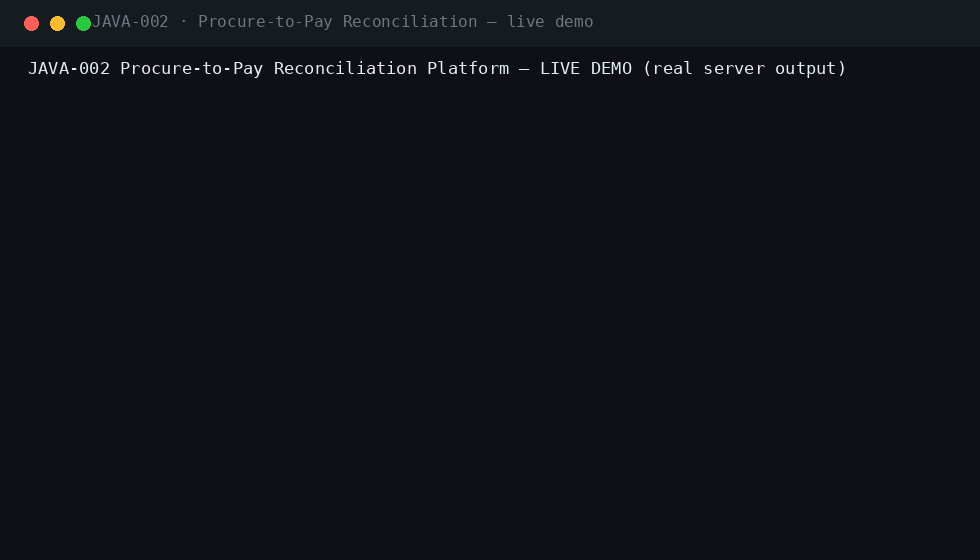
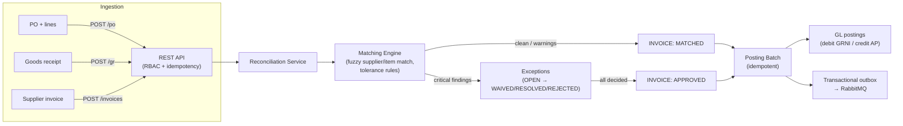
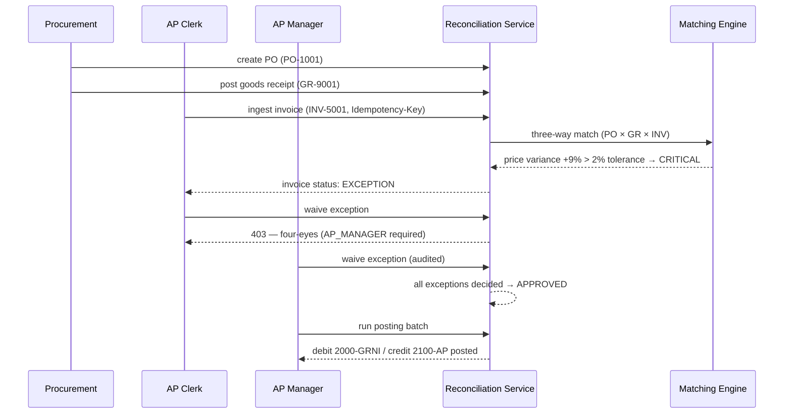
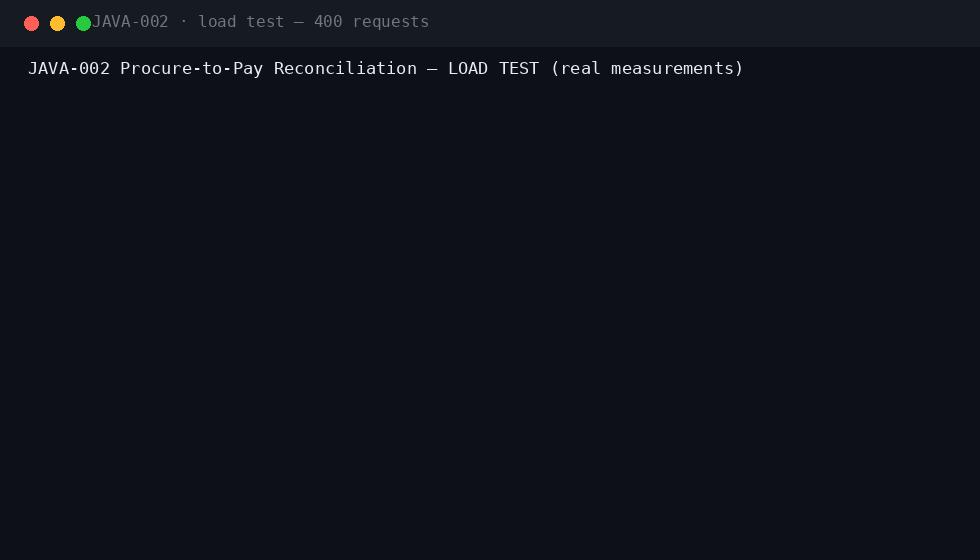
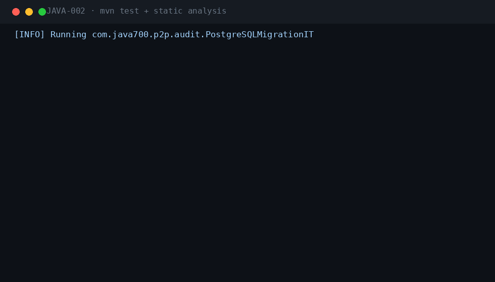

<div align="center">

#  &nbsp;Procure-to-Pay Reconciliation Platform

**JAVA-002** · Enterprise Procure-to-Pay · Spring Boot 3.5.3 · Java 21

[](.)
[](.)
[](.)
[](.)
[](.)
[](.)
[](.)

*Three-way matching of purchase orders, goods receipts and invoices — with tolerance rules, exception routing, four-eyes waivers and transactional GL posting.*

</div>

---

## 📖 What this is

| | |
|---|---|
| **Business problem** | Three-way mismatches (PO ↔ goods receipt ↔ invoice) create payment leakage, supplier disputes and audit findings when handled in spreadsheets. |
| **Engineering problem** | A deterministic matching engine with fuzzy supplier/item normalization, tolerance rules, exception state machines, and a posting batch that is idempotent under re-runs and crashes. |
| **Why it is industrial** | Segregation of duties between AP clerk and AP manager, transactional outbox for downstream integrations, full audit trail with correlation IDs — the anatomy of a real finance-grade pipeline. |

## ⚡ Quickstart

```bash
# zero dependencies: embedded H2 + built-in identity provider
mvn spring-boot:run -Dspring-boot.run.profiles=dev
# Swagger UI → http://localhost:8080/swagger-ui.html
```

```bash
# full local production-like stack
cp .env.example .env && docker compose up --build
# PostgreSQL 16 · RabbitMQ 3.13 (DLX) · Prometheus · Grafana
```

**Demo users** (password `Password123!`): `apclerk` · `apmanager` · `procurement` · `auditor` · `admin` · `integrator`

## 🎬 Live demo (real server output)



The full loop, captured against a running instance: **PO → goods receipt → invoice ingest → automatic three-way match → price-variance exception → four-eyes waiver (clerk blocked, manager waives) → posting batch → final invoice states.**

## 🏗 Architecture





## ⚡ Performance (measured on a local run)



| Metric | Value |
|---|---|
| Requests | 400 mixed GET (invoices / exceptions / rules) |
| Concurrency | 10 workers |
| Throughput | **332.5 req/s** |
| Latency p50 / p95 / p99 | 25.4 ms / 62.8 ms / 119.6 ms |
| Result | 400/400 HTTP 200 |

## 🧪 Verified test output



| Suite | Coverage |
|---|---|
| `MatchingEngineTest` (11) | exact match, item-code normalization, price/quantity variance inside & beyond tolerance, missing receipt, over-billing, currency mismatch, fuzzy supplier match |
| `P2PFlowIT` (6) | full PO→GR→invoice→waiver→posting loop, idempotent replay, duplicate invoice rejection, PO view |
| `SecurityIT` (7) | role matrix, four-eyes enforcement, admin-only rule edits, injection attempts, lockout |
| `PostgreSQLMigrationIT` | Flyway V1–V3 on real PostgreSQL 16 (CI) |

`mvn verify -Pstatic-analysis` → **Checkstyle clean · SpotBugs 0 bugs**.

## 🔐 Security model

| Capability | AP_CLERK | AP_MANAGER | PROCUREMENT | AUDITOR | ADMIN | INTEGRATION |
|---|---|---|---|---|---|---|
| Create PO / GR | ❌ | ❌ | ✅ | ❌ | ✅ | ✅ |
| Ingest invoice | ✅ | ✅ | ❌ | ❌ | ✅ | ✅ |
| Re-run match | ✅ | ✅ | ❌ | ❌ | ✅ | ❌ |
| Assign exception | ✅ | ✅ | ❌ | ❌ | ✅ | ❌ |
| Waive / reject (four-eyes) | ❌ | ✅ | ❌ | ❌ | ✅ | ❌ |
| Update tolerance rules | ❌ | ❌ | ❌ | ❌ | ✅ | ❌ |
| Run posting batch | ❌ | ✅ | ❌ | ❌ | ✅ | ❌ |

Plus: JWT + Argon2id local IdP with lockout · Idempotency-Key replay protection · RFC 7807 errors with correlation IDs · audit log in the same transaction as every business write · threat model in `docs/SECURITY.md`.

## 🗂 Repository

```
projects/java-002/
├── src/main/java/com/java700/p2p/
│   ├── matching/     FuzzyNormalizer + MatchingEngine (pure, deterministic)
│   ├── domain/       PO, GR, Invoice, exceptions, tolerance rules, GL postings, outbox
│   ├── service/      ReconciliationService (match, waive, batch, scheduled posting)
│   ├── api/          REST controllers + request/response records
│   └── security/     RBAC roles, local IdP, JWT resource server
├── src/main/resources/db/migration/   V1 common · V2 p2p schema · V3 tolerance rules
├── docker/           docker-compose: PostgreSQL, RabbitMQ, Prometheus, Grafana
├── docs/             ARCHITECTURE · SECURITY (threat model) · RUNBOOK · ADRs · demo/perf/tests GIFs
└── jmeter/           load plan
```

## 🧰 Engineering highlights

- **Deterministic matching engine** — supplier Jaro-Winkler fuzzy matching, item-code normalization, three-way quantity/price reconciliation with per-type tolerance rules (WARN / BLOCK / AUTO_POST).
- **Exception state machine** — OPEN → RESOLVED / WAIVED / REJECTED; waivers are four-eyes and audited; warnings auto-resolve within tolerance.
- **Idempotency everywhere** — ingest, waive, batch: replays return the original resource, duplicates are rejected at the unique-constraint.
- **Transactional outbox** — downstream events (`INVOICE_POSTED`) survive crashes and are published via RabbitMQ with DLX in the local profile.
- **Graceful degradation** — dev profile runs with zero external services; local profile upgrades to PostgreSQL + RabbitMQ via health-gated Compose.

---

<div align="center">

**Part of the [Java-700 portfolio](https://github.com/Madanpatel21/Java-Project-portfolio)** — 700 unique industrial-grade Java systems.

</div>
