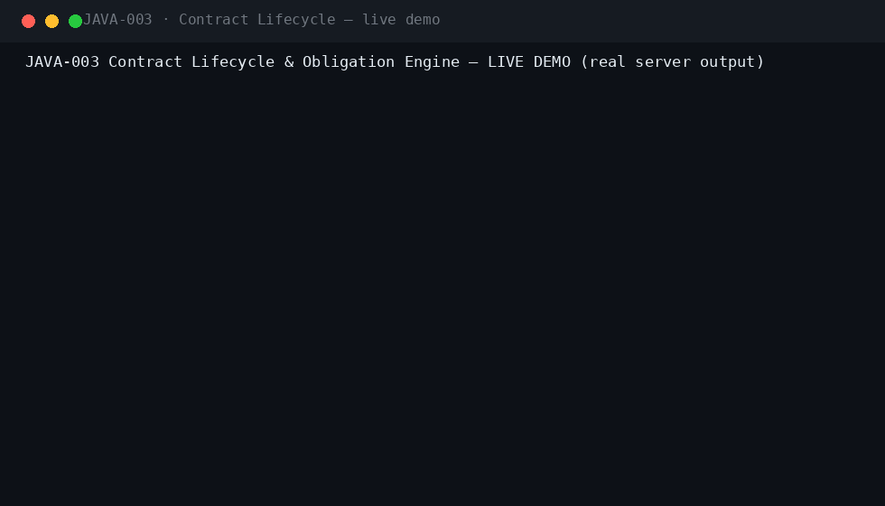
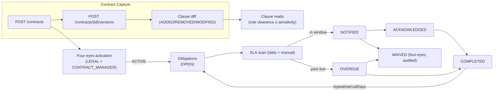
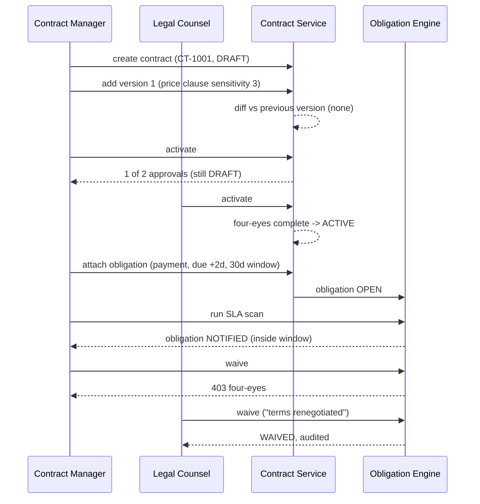
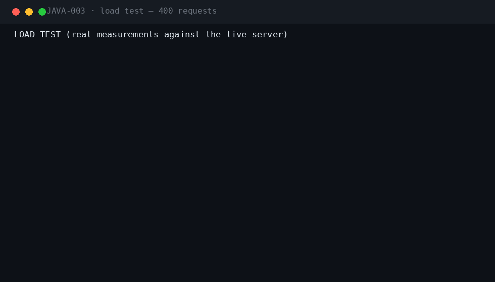
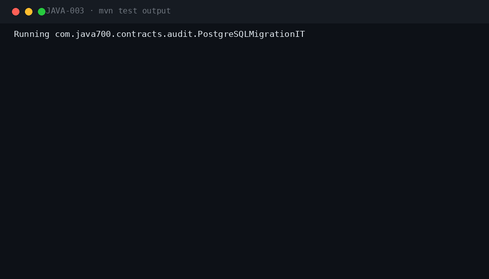

<div align="center">

#  &nbsp;Contract Lifecycle & Obligation Engine

**JAVA-003** · LegalTech / Enterprise · Spring Boot 3.5.3 · Java 21

[](.)
[](.)
[](.)
[](.)
[](.)
[](.)
[](.)

*Versioned clauses with role-based redaction, four-eyes activation, and an obligation SLA engine that never lets a renewal, payment or exit right slip.*

</div>

---

## 📖 What this is

| | |
|---|---|
| **Business problem** | Obligations buried in contracts (renewals, payments, exit rights) are missed — costing millions and breaching compliance. |
| **Engineering problem** | Immutable contract versions with clause-level diffing, clearance-based redaction, a four-eyes approval chain, and an obligation state machine with SLA windows, overdue escalation and recurrence. |
| **Why it is industrial** | Clause-level security (finance sees pricing, auditors see redactions), audited waivers, recurring obligations that self-spawn — the anatomy of legal-grade governance. |

## ⚡ Quickstart

```bash
mvn spring-boot:run -Dspring-boot.run.profiles=dev     # zero dependencies
# Swagger UI → http://localhost:8080/swagger-ui.html
```

```bash
cp .env.example .env && docker compose up --build       # PostgreSQL 16 · RabbitMQ · Prometheus · Grafana
```

**Demo users** (password `Password123!`): `legal` · `cmanager` · `owner` · `finance` · `auditor` · `admin`

## 🎬 Live demo (real server output)



Captured against a running instance: **contract creation → versioned clauses → clearance redaction (FINANCE sees the price clause, AUDITOR gets REDACTED) → four-eyes activation (manager + legal) → obligation with a 30-day SLA window → scan → NOTIFIED → waiver blocked for the manager, audited for legal.**

## 🏗 Architecture





## ⚡ Performance (measured on a local run)



| Metric | Value |
|---|---|
| Requests | 400 mixed GET (contracts / obligations / health) |
| Concurrency | 10 workers |
| Throughput | **272.2 req/s** |
| Latency p50 / p95 / p99 | 31.4 ms / 49.4 ms / 60.6 ms |
| Result | 400/400 HTTP 200 |

## 🧪 Verified test output



| Suite | Coverage |
|---|---|
| `ContractDiffTest` (5) | ADDED/REMOVED/MODIFIED detection, old+new text, malformed JSON, clause parsing |
| `ContractFlowIT` (5) | four-eyes activation, clearance redaction per role, obligation SLA lifecycle + waiver, recurrence spawning, version diff endpoint |
| `SecurityIT` (6) | role matrix, four-eyes enforcement, auditor read-only, injection, lockout, validation-first |
| `PostgreSQLMigrationIT` | Flyway V1–V2 on real PostgreSQL 16 (CI) |

`mvn verify -Pstatic-analysis` → **Checkstyle clean · SpotBugs 0 bugs**.

## 🔐 Security model

| Capability | LEGAL | CONTRACT_MANAGER | BUSINESS_OWNER | FINANCE | AUDITOR | ADMIN |
|---|---|---|---|---|---|---|
| Create contract / version | ✅ | ✅ | ❌ | ❌ | ❌ | ✅ |
| Activate (four-eyes) | ✅ | ✅ | ❌ | ❌ | ❌ | ✅ |
| Clause clearance level | 4 | 4 | 3 | 3 | 2 | 4 |
| Attach / complete obligations | ✅ | ✅ | ✅(complete) | ❌ | ❌ | ✅ |
| Waive obligation (four-eyes) | ✅ | ❌ | ❌ | ❌ | ❌ | ✅ |
| Terminate contract | ✅ | ✅ | ❌ | ❌ | ❌ | ✅ |

Plus: JWT + Argon2id local IdP with lockout · Idempotency-Key on every mutation · RFC 7807 errors with correlation IDs · full audit trail · threat model in `docs/SECURITY.md`.

## 🗂 Repository

```
projects/java-003/
├── src/main/java/com/java700/contracts/
│   ├── matching/     ContractDiff (clause-level ADDED/REMOVED/MODIFIED)
│   ├── domain/       Contract, versions, Obligation (SLA state machine), events, approvals
│   ├── service/      ContractService (versions, four-eyes, obligations, SLA scan, recurrence)
│   ├── api/          REST controllers
│   └── security/     Roles + clause-clearance model, local IdP, JWT
├── src/main/resources/db/migration/   V1 common · V2 contracts schema
├── docker/           docker-compose: PostgreSQL, RabbitMQ, Prometheus, Grafana
├── docs/             ARCHITECTURE · SECURITY · RUNBOOK · ADRs · logo · demo/perf/tests GIFs
└── jmeter/           load plan
```

## 🧰 Engineering highlights

- **Immutable versioning + diffs** — every version is frozen; clause-level diffs (ADDED/REMOVED/MODIFIED) are computed on demand for legal review.
- **Clause-level security** — each clause carries a sensitivity level; reads are redacted by role clearance, so finance sees pricing while auditors see `[REDACTED]`.
- **Four-eyes everywhere** — activation needs LEGAL + CONTRACT_MANAGER; waivers need LEGAL; every decision is audited.
- **Obligation SLA engine** — window-based notifications, overdue escalation, acknowledgement/completion, and recurring obligations that self-spawn the next instance.
- **Zero-dependency dev, full stack in one command** — H2 in dev, PostgreSQL + RabbitMQ via health-gated Compose in local.

---

<div align="center">

**Part of the [Java-700 portfolio](https://github.com/Madanpatel21/Java-Project-portfolio)** — 700 unique industrial-grade Java systems.

</div>
