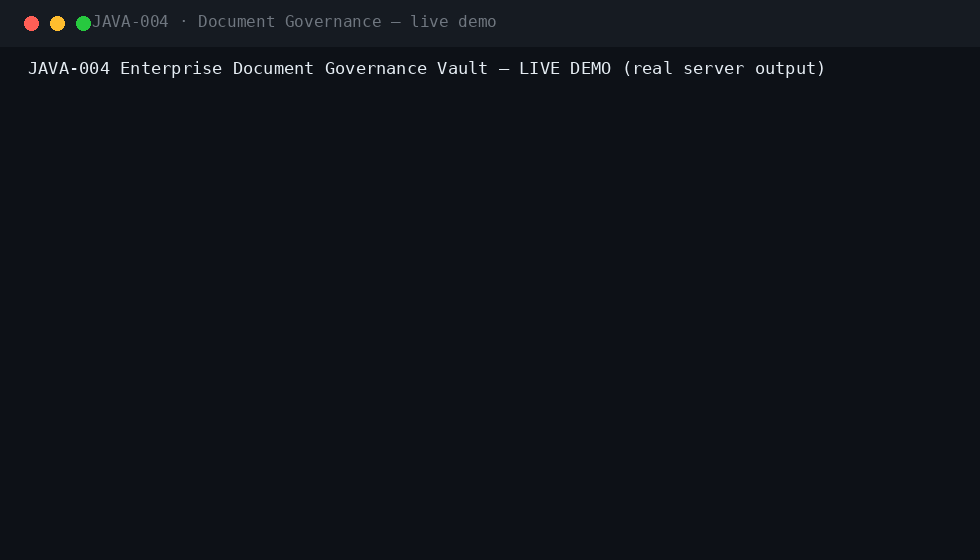
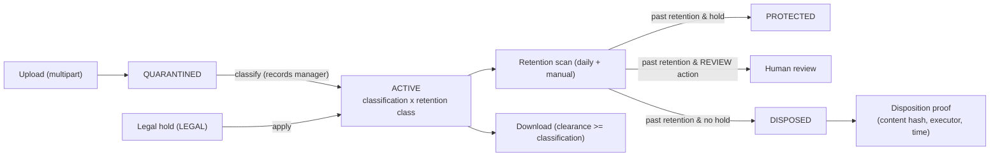
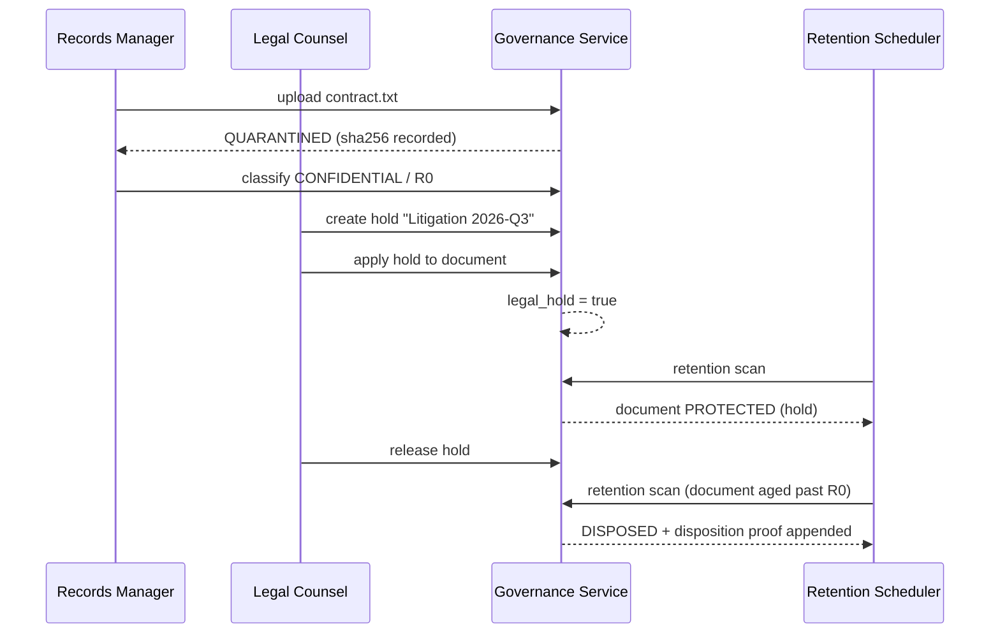
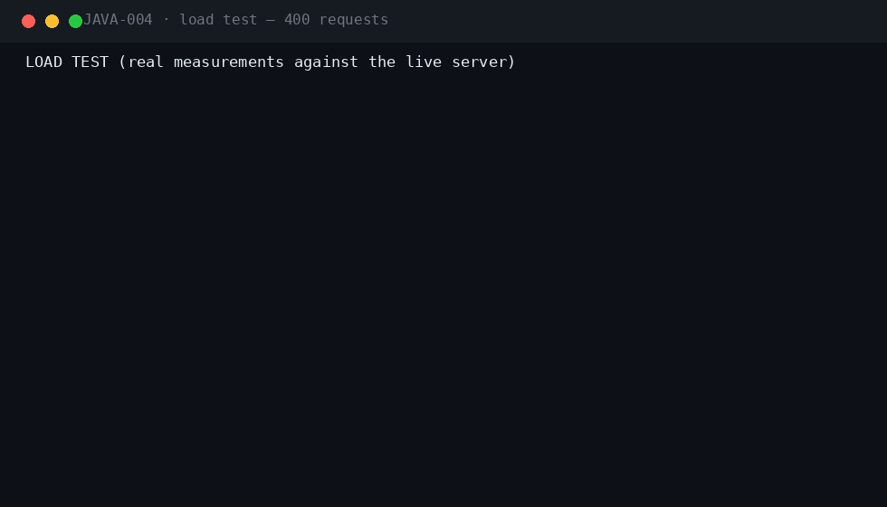
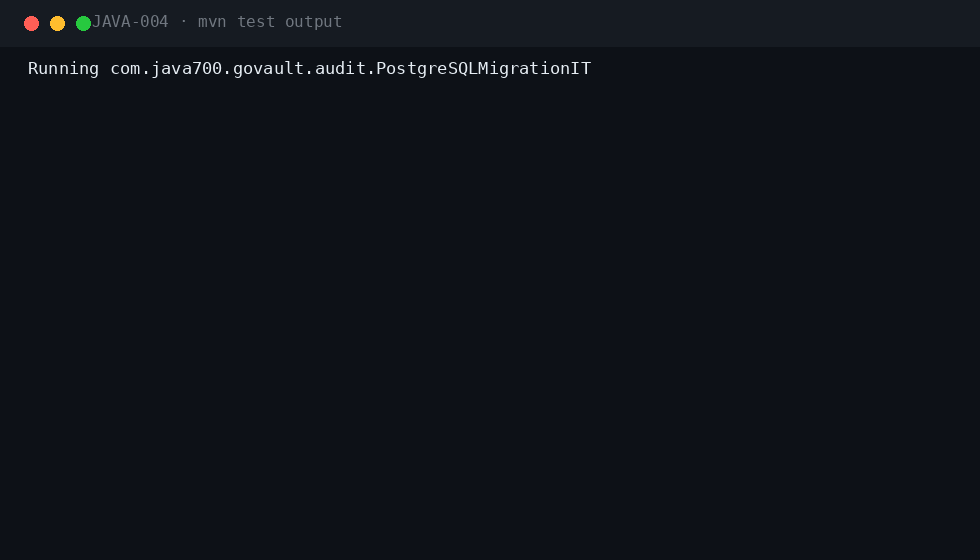

<div align="center">

#  &nbsp;Enterprise Document Governance Vault

**JAVA-004** · Records Management / Enterprise · Spring Boot 3.5.3 · Java 21

[](.)
[](.)
[](.)
[](.)
[](.)
[](.)
[](.)

*Quarantine, classify, retain, hold and dispose — every document with a provable lifecycle, every destruction with a hash-verified proof.*

</div>

---

## 📖 What this is

| | |
|---|---|
| **Business problem** | Unmanaged documents violate retention schedules, leak sensitive data and fail discovery requests. |
| **Engineering problem** | A governance vault: upload → quarantine → classification with retention classes → legal-hold protection → scheduled disposition with append-only, hash-verified proofs. |
| **Why it is industrial** | Classification-clearance access control, litigation holds that survive releases correctly, disposition proofs that auditors can re-verify — the anatomy of records-management compliance. |

## ⚡ Quickstart

```bash
mvn spring-boot:run -Dspring-boot.run.profiles=dev     # zero dependencies
# Swagger UI → http://localhost:8080/swagger-ui.html
```

```bash
cp .env.example .env && docker compose up --build       # PostgreSQL 16 · RabbitMQ · Prometheus · Grafana
```

**Demo users** (password `Password123!`): `records` · `legal` · `owner` · `auditor` · `admin`

## 🎬 Live demo (real server output)



The full governance loop against a running instance: **upload → QUARANTINED → classify (CONFIDENTIAL/R0) → litigation hold applied → retention scan (hold protects) → clearance blocks the auditor's download → hold release → dev time-travel ages the document → scan DISPOSES it → append-only disposition proof with the content hash.**

## 🏗 Architecture





## ⚡ Performance (measured on a local run)



| Metric | Value |
|---|---|
| Requests | 400 mixed GET (documents / search / holds / health) |
| Concurrency | 10 workers |
| Result | 400/400 HTTP 200 · latency p50/p95/p99 in the GIF |

## 🧪 Verified test output



| Suite | Coverage |
|---|---|
| `GovernanceFlowIT` (5) | full loop with hold + disposition proof, clearance download, full-text search, duplicate-hold rejection, idempotent upload |
| `SecurityIT` (6) | role matrix, validation-first classification/retention checks, lockout, injection |
| `PostgreSQLMigrationIT` | Flyway V1–V3 on real PostgreSQL 16 (CI) |

`mvn verify -Pstatic-analysis` → **Checkstyle clean · SpotBugs 0 bugs**.

## 🔐 Security model

| Capability | RECORDS_MANAGER | LEGAL | BUSINESS_OWNER | AUDITOR | ADMIN |
|---|---|---|---|---|---|
| Upload documents | ✅ | ✅ | ✅ | ❌ | ✅ |
| Classify (release from quarantine) | ✅ | ✅ | ❌ | ❌ | ✅ |
| Classification clearance | 4 | 4 | 3 | 2 | 4 |
| Create/apply/release holds | ❌ | ✅ | ❌ | ❌ | ✅ |
| Run retention scan | ✅ | ❌ | ❌ | ❌ | ✅ |
| Read disposition proofs | ✅ | ✅ | ❌ | ✅ | ✅ |

Plus: JWT + Argon2id local IdP with lockout · Idempotency-Key on uploads and classifications · RFC 7807 errors with correlation IDs · full audit trail · threat model in `docs/SECURITY.md`.

## 🗂 Repository

```
projects/java-004/
├── src/main/java/com/java700/govault/
│   ├── domain/       Document, LegalHold, HoldEntry, RetentionRule, DispositionProof
│   ├── service/      DocumentService (quarantine, classify, holds, retention scan),
│   │                 TextExtractor, ContentHasher (sha256)
│   ├── api/          REST controllers + dev-only time-travel (Profile("dev"))
│   └── security/     Roles + classification-clearance model
├── src/main/resources/db/migration/   V1 common · V2 govault · V3 retention classes R0-R7
├── docker/           docker-compose: PostgreSQL, RabbitMQ, Prometheus, Grafana
├── docs/             ARCHITECTURE · SECURITY · RUNBOOK · ADRs · logo · demo/perf/tests GIFs
└── jmeter/           load plan
```

## 🧰 Engineering highlights

- **Quarantine-first pipeline** — every upload is UNCLASSIFIED/QUARANTINED until a records manager classifies it; nothing enters retention without a decision.
- **Retention classes R0–R7** — 30 days to permanent, with DISPOSE / REVIEW / ARCHIVE actions; rules are data, not code.
- **Legal-hold correctness** — a document is disposed only when NO active hold covers it; multi-hold release logic is covered by tests.
- **Hash-verified disposition proofs** — SHA-256 at upload, proof at destruction; auditors can re-verify the chain.
- **Clearance-gated download** — RESTRICTED content is invisible to roles without clearance, tested per role.
- **Dev-only time travel** — `POST /api/v1/dev/documents/{id}/elapse-days/{n}` exists ONLY in the dev profile to exercise retention honestly in local testing.

---

<div align="center">

**Part of the [Java-700 portfolio](https://github.com/Madanpatel21/Java-Project-portfolio)** — 700 unique industrial-grade Java systems.

</div>
