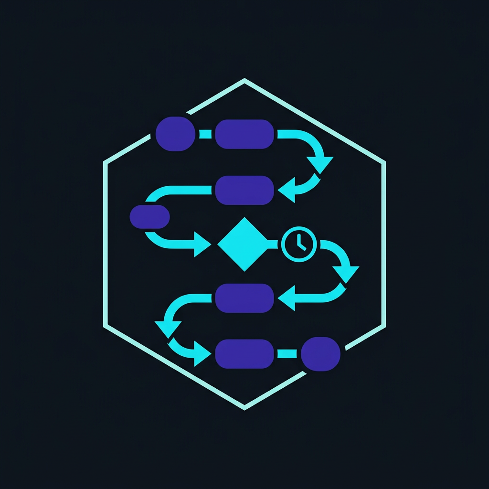
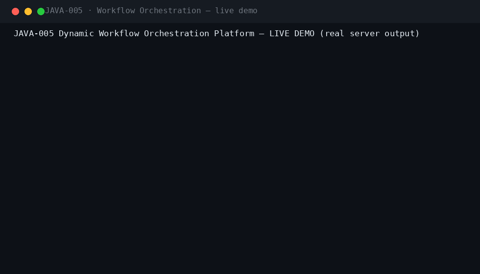
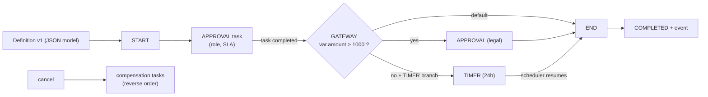
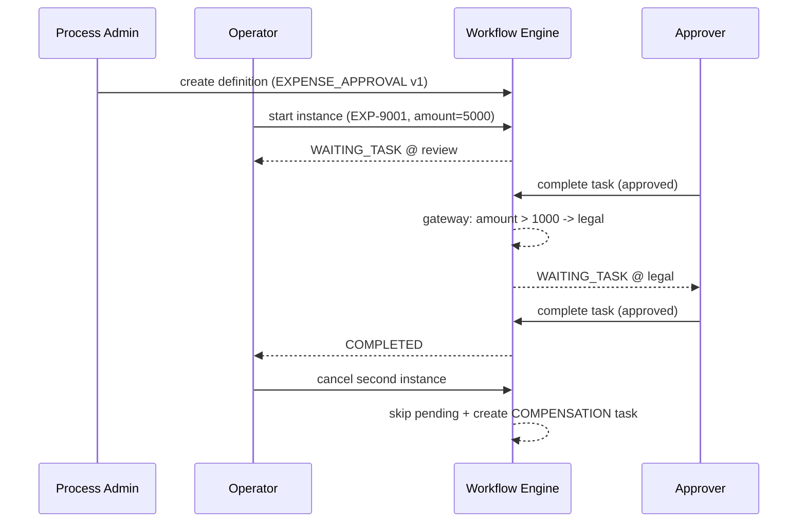
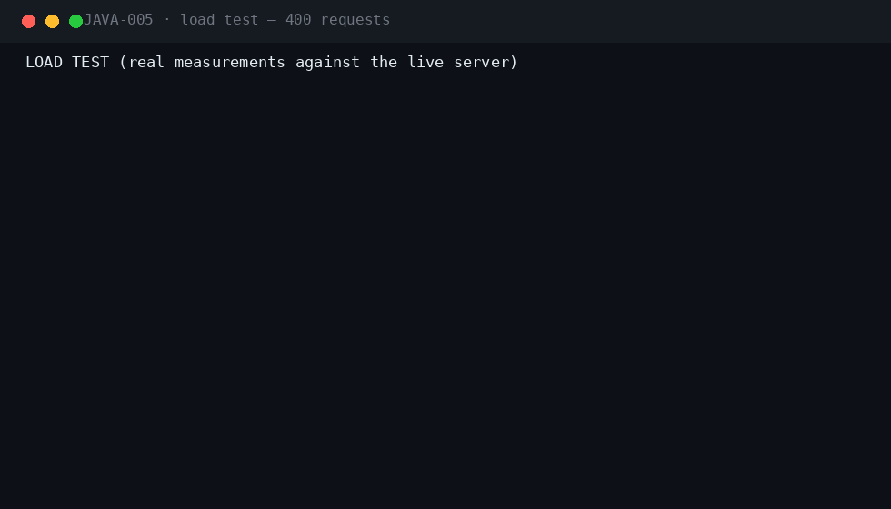
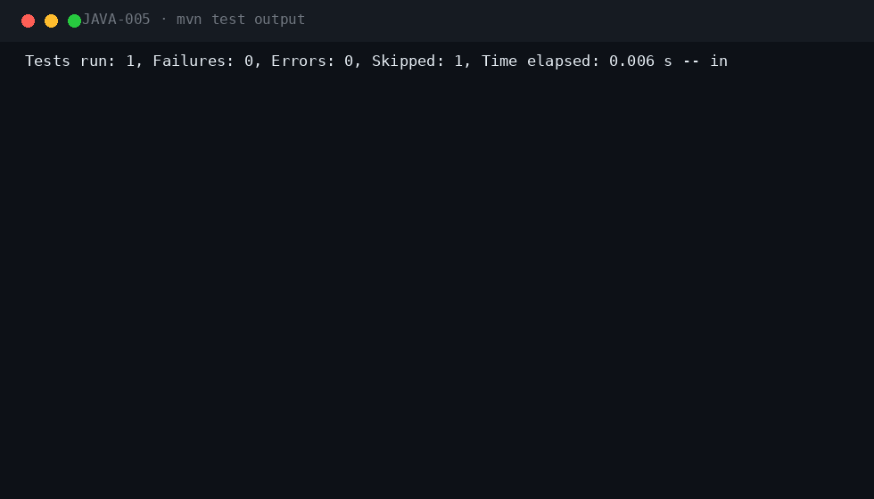

<div align="center">

#  &nbsp;Dynamic Workflow Orchestration Platform

**JAVA-005** · Enterprise BPM / SaaS · Spring Boot 3.5.3 · Java 21

[](.)
[](.)
[](.)
[](.)
[](.)
[](.)
[](.)

*Versioned, model-driven workflows with human tasks, SLA escalation, timers, dynamic routing and cancellation with compensation.*

</div>

---

## 📖 What this is

| | |
|---|---|
| **Business problem** | Business processes span teams and systems; hard-coded flows break on every reorg, and ad-hoc work goes untracked. |
| **Engineering problem** | A deterministic workflow interpreter over versioned definition models — human approval tasks, gateway routing on instance variables, timers, SLA escalation and compensation on cancellation. |
| **Why it is industrial** | Instances are pinned to their definition version (no mid-flight redefinition), every execution step is an append-only trace, and cancellations create audited compensation work — the anatomy of real BPM engines. |

## ⚡ Quickstart

```bash
mvn spring-boot:run -Dspring-boot.run.profiles=dev     # zero dependencies
# Swagger UI → http://localhost:8080/swagger-ui.html
```

```bash
cp .env.example .env && docker compose up --build       # PostgreSQL 16 · RabbitMQ · Prometheus · Grafana
```

**Demo users** (password `Password123!`): `padmin` · `operator` · `approver` · `viewer` · `admin`

## 🎬 Live demo (real server output)



Captured against a running instance: **definition creation → instance start (amount=5000) → approval task → gateway routes to legal review → completion → a second instance (amount=100) cancelled → compensation task appears in the worklist.**

## 🏗 Architecture





## ⚡ Performance (measured on a local run)



| Metric | Value |
|---|---|
| Requests | 400 mixed GET (definitions / worklist / health) |
| Concurrency | 10 workers |
| Result | 400/400 HTTP 200 · latency p50/p95/p99 in the GIF |

## 🧪 Verified test output



| Suite | Coverage |
|---|---|
| `WorkflowEngineTest` (8) | start→task, gateway routing both branches, timer resume→completion, variable merges, compensation declaration, malformed definitions, gateway failure |
| `ExpressionEvaluatorTest` (4) | numeric/string/boolean comparisons, unsupported expressions |
| `WorkflowFlowIT` (4) | dual-approval chain end-to-end, low-amount skip, version deprecation, cancel → compensation (pending) |
| `SecurityIT` (6) | role matrix, viewer read-only, malformed definition 400, injection, lockout |
| `PostgreSQLMigrationIT` | Flyway on real PostgreSQL 16 (CI) |

`mvn verify -Pstatic-analysis` → **Checkstyle clean · SpotBugs 0 bugs**.

## 🔐 Security model

| Capability | PROCESS_ADMIN | PROCESS_OPERATOR | APPROVER | VIEWER | ADMIN |
|---|---|---|---|---|---|
| Create/version definitions | ✅ | ❌ | ❌ | ❌ | ✅ |
| Start / cancel instances | ✅ | ✅ | ❌ | ❌ | ✅ |
| Complete tasks | ✅ | ❌ | ✅ | ❌ | ✅ |
| Worklist / read state | ✅ | ✅ | ✅ | ✅ | ✅ |
| Run scheduler scans | ✅ | ❌ | ❌ | ❌ | ✅ |

Plus: JWT + Argon2id local IdP with lockout · Idempotency-Key on starts/task-completions/definitions · RFC 7807 errors with correlation IDs · audit trail · threat model in `docs/SECURITY.md`.

## 🗂 Repository

```
projects/java-005/
├── src/main/java/com/java700/wflow/
│   ├── engine/      WorkflowModel (definition parser), WorkflowEngine (pure interpreter),
│   │                ExpressionEvaluator (gateway conditions)
│   ├── domain/      Definitions, instances, tasks (SLA), steps (append-only trace)
│   ├── service/     WorkflowService (plan application, cancel+compensation, schedulers)
│   └── api/         REST controllers
├── src/main/resources/db/migration/   V1 common · V2 workflow schema
├── docker/          docker-compose: PostgreSQL, RabbitMQ, Prometheus, Grafana
├── docs/            ARCHITECTURE · SECURITY · RUNBOOK · ADRs · logo · demo/perf/tests GIFs
└── jmeter/          load plan
```

## 🧰 Engineering highlights

- **Pure interpreter, side-effect-free** — the engine returns an action plan; the service applies it transactionally. Fully unit-testable without a database.
- **Version pinning** — new definition versions deprecate the old; running instances keep executing their own snapshot.
- **Gateway routing** — declarative condition expressions (`var.amount > 1000`) evaluated against instance variables.
- **SLA escalation + timers** — overdue tasks are escalated on a schedule; timer nodes suspend and resume instances.
- **Cancellation with compensation** — pending tasks are skipped and reverse-order compensation tasks are created, all audited.

---

<div align="center">

**Part of the [Java-700 portfolio](https://github.com/Madanpatel21/Java-Project-portfolio)** — 700 unique industrial-grade Java systems.

</div>
