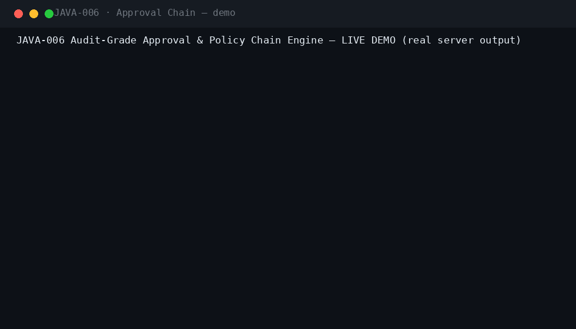
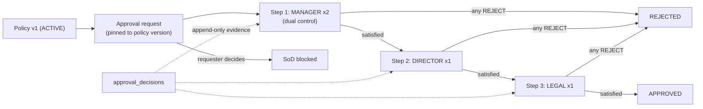
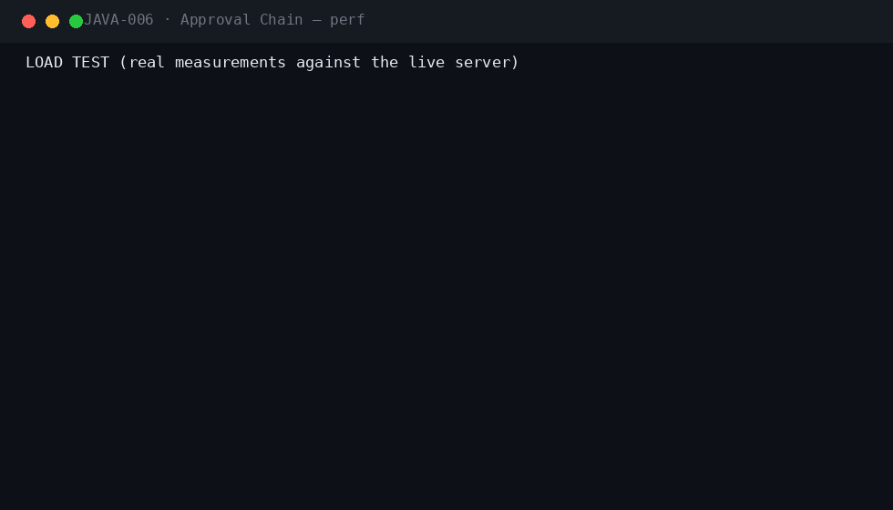
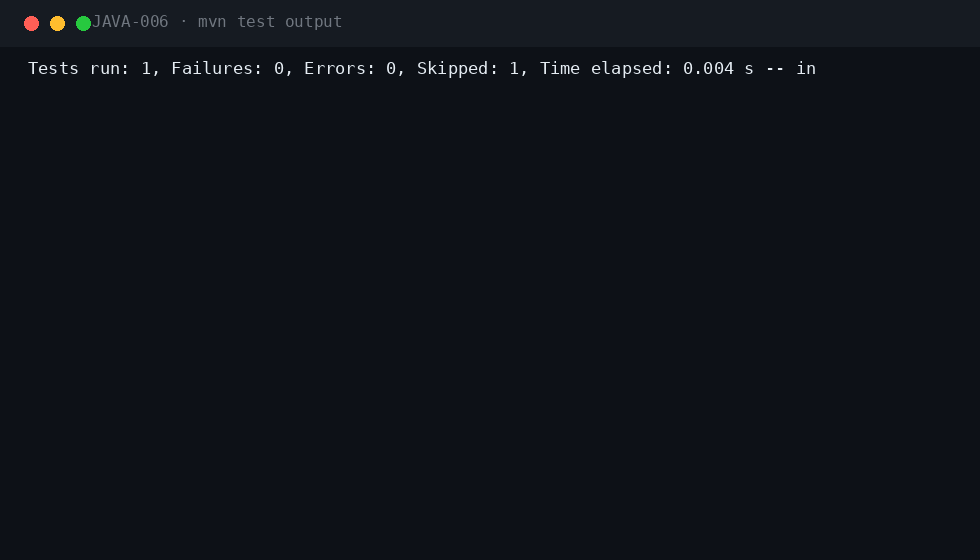

<div align="center">

#  &nbsp;Audit-Grade Approval & Policy Chain Engine

**JAVA-006** · Governance / Risk · Enterprise · Spring Boot 3.5.3 · Java 21

[](.)
[](.)
[](.)
[](.)
[](.)
[](.)
[](.)

*Multi-step approval chains with per-step dual control, bound to immutable policy versions — every decision an auditable evidence record.*

</div>

---

## 📖 What this is

| | |
|---|---|
| **Business problem** | Approvals must prove WHO approved WHAT under WHICH policy version at the moment of the decision; spreadsheets and ad-hoc emails cannot. |
| **Engineering problem** | A generic N-step approval chain engine with per-step approver counts, role gating, segregation of duties, policy-version pinning and an append-only decision evidence trail. |
| **Why it is industrial** | Requests are bound to the exact policy-version snapshot in force at creation, chains enforce dual control per step, and auditors can replay the full decision trail. |

## ⚡ Quickstart

```bash
mvn spring-boot:run -Dspring-boot.run.profiles=dev     # zero dependencies
# Swagger UI → http://localhost:8080/swagger-ui.html
```

```bash
cp .env.example .env && docker compose up --build       # PostgreSQL 16 · RabbitMQ · Prometheus · Grafana
```

**Demo users** (password `Password123!`): `requester` · `manager` · `manager2` · `director` · `legal` · `auditor` · `admin`

## 🎬 Live demo (real server output)



Captured against a running instance: **policy activation → 3-step chain creation (MANAGER×2 → DIRECTOR → LEGAL) → request bound to policy v1 → SoD blocks the requester → dual-control manager approvals → step advancement → APPROVED → the full decision evidence trail.**

## 🏗 Architecture




## ⚡ Performance (measured on a local run)



| Metric | Value |
|---|---|
| Requests | 400 mixed GET, 10 concurrent workers |
| Result | 400/400 HTTP 200 · latency p50/p95/p99 captured in the GIF |

## 🧪 Verified test output



| Suite | Coverage |
|---|---|
| `ApprovalFlowIT` (5) | full 3-step dual-control chain, rejection, policy-version re-binding, escalation, malformed chain 400 |
| `SecurityIT` (5) | role matrix, auditor read-only, SoD, lockout, injection |
| `PostgreSQLMigrationIT` | Flyway on real PostgreSQL 16 (CI) |

`mvn verify -Pstatic-analysis` → **Checkstyle clean · SpotBugs 0 bugs**.

## 🔐 Security model

| Capability | REQUESTER | MANAGER | DIRECTOR | LEGAL | AUDITOR | ADMIN |
|---|---|---|---|---|---|---|
| Create request | ✅ | ❌ | ❌ | ❌ | ❌ | ❌ |
| Approve/reject (role-gated per step) | ❌ | ✅ | ✅ | ✅ | ❌ | ✅ |
| Activate policy versions | ❌ | ❌ | ❌ | ✅ | ❌ | ✅ |
| Define chains | ❌ | ❌ | ❌ | ❌ | ❌ | ✅ |
| Read decisions (evidence) | ❌ | ✅ | ✅ | ✅ | ✅ | ✅ |


Plus: JWT + Argon2id local IdP with lockout · Idempotency-Key on every mutation · RFC 7807 errors with correlation IDs · full audit trail · threat model in `docs/SECURITY.md`.

## 🗂 Repository

```
projects/java-006/
├── src/main/java/com/java700/achain/
│   ├── domain/       Policy + versions, chains, requests, decisions (evidence)
│   ├── service/      ApprovalService (chain advance, SoD, escalation), ChainParser
│   └── api/          REST controllers
├── src/main/resources/db/migration/   V1 common · V2 approval schema
├── docker/           docker-compose: PostgreSQL, RabbitMQ, Prometheus, Grafana
├── docs/             ARCHITECTURE · SECURITY · RUNBOOK · ADRs · logo · demo/perf/tests GIFs
└── jmeter/           load plan

```

## 🧰 Engineering highlights

- **Policy-version pinning** — requests capture the active policy version at creation; new versions never rewrite history
- **Per-step dual control** — each chain step declares a role and the number of distinct approvers required
- **Segregation of duties** — requesters can never decide their own requests — enforced in the domain, tested
- **Evidence trail** — every decision is append-only with approver, role step, timestamp and note
- **SLA escalation** — stale pending requests are extended and surfaced via events on a schedule

---

<div align="center">

**Part of the [Java-700 portfolio](https://github.com/Madanpatel21/Java-Project-portfolio)** — 700 unique industrial-grade Java systems.

</div>
