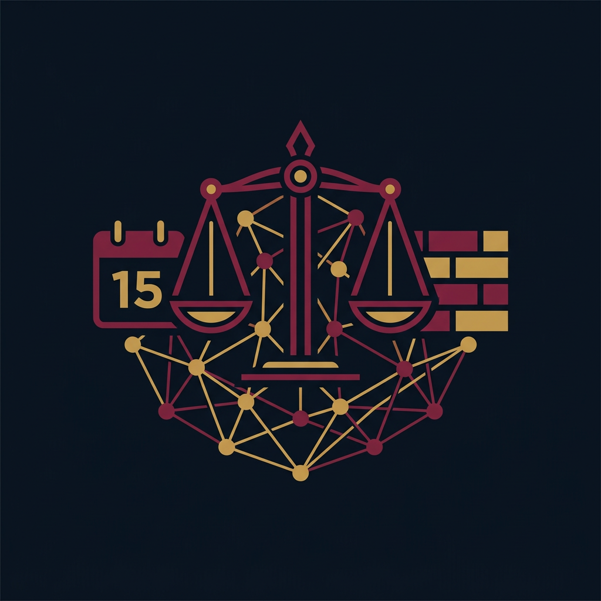
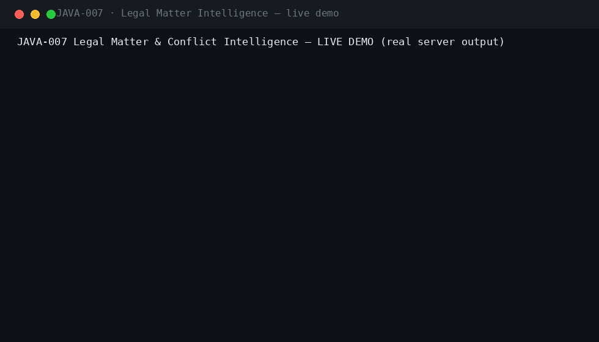
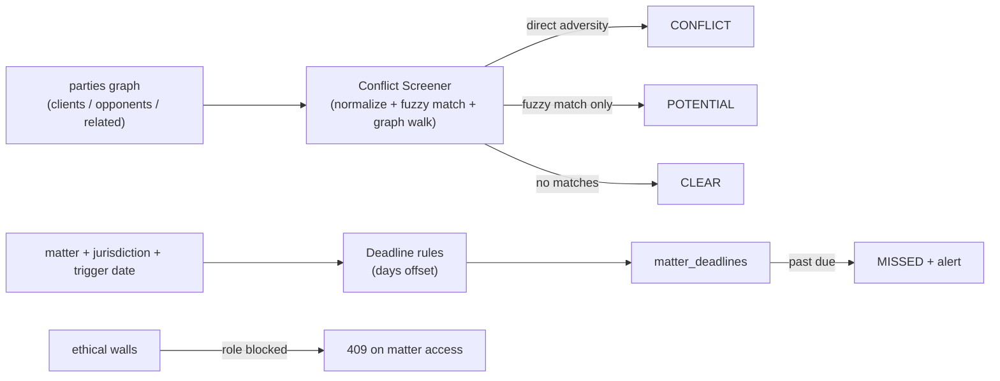
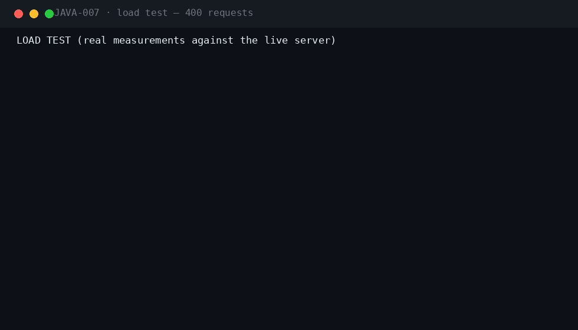
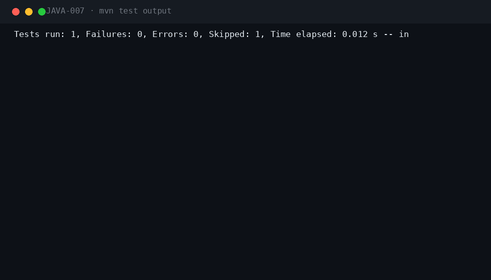

<div align="center">

#  &nbsp;Legal Matter & Conflict Intelligence

**JAVA-007** · LegalTech · Enterprise · Spring Boot 3.5.3 · Java 21

[](.)
[](.)
[](.)
[](.)
[](.)
[](.)
[](.)

*Party-graph conflict screening, court-calendar deadline computation and ethical-wall enforcement — malpractice exposure, engineered away.*

</div>

---

## 📖 What this is

| | |
|---|---|
| **Business problem** | Law firms take matters that conflict with existing clients, and court deadlines slip — both cause malpractice exposure. |
| **Engineering problem** | Graph-walk conflict screening over a parties graph with fuzzy name matching, rule-driven court-deadline computation, and role-based ethical walls. |
| **Why it is industrial** | Direct adversity across matters is detected by graph traversal, fuzzy matches surface as POTENTIAL for analyst review, deadlines are computed from jurisdiction rules and missed deadlines are escalated — the anatomy of legal-grade risk control. |

## ⚡ Quickstart

```bash
mvn spring-boot:run -Dspring-boot.run.profiles=dev     # zero dependencies
# Swagger UI → http://localhost:8080/swagger-ui.html
```

```bash
cp .env.example .env && docker compose up --build       # PostgreSQL 16 · RabbitMQ · Prometheus · Grafana
```

**Demo users** (password `Password123!`): `attorney` · `paralegal` · `analyst` · `litteam` · `auditor` · `admin`

## 🎬 Live demo (real server output)



Captured against a running instance: **parties + matter graph → conflict screen (Delta vs Beta → CONFLICT with the adverse-matter finding; Epsilon vs Zeta → CLEAR) → court deadlines computed from jurisdiction rules → ethical wall blocks LITIGATION_TEAM while the attorney retains access.**

## 🏗 Architecture




## ⚡ Performance (measured on a local run)



| Metric | Value |
|---|---|
| Requests | 400 mixed GET, 10 concurrent workers |
| Result | 400/400 HTTP 200 · latency p50/p95/p99 captured in the GIF |

## 🧪 Verified test output



| Suite | Coverage |
|---|---|
| `ConflictScreenerTest` (6) | clear/potential/conflict outcomes, graph-walk adversity, fuzzy resolution, normalization + Jaro-Winkler |
| `LegalFlowIT` (2) | full loop (parties → matter → screen → deadlines → walls), missed-deadline detection |
| `SecurityIT` (6) | role matrix, ethical-wall access control, validation, lockout, injection |
| `PostgreSQLMigrationIT` | Flyway V1–V3 on real PostgreSQL 16 (CI) |

`mvn verify -Pstatic-analysis` → **Checkstyle clean · SpotBugs 0 bugs**.

## 🔐 Security model

| Capability | ATTORNEY | PARALEGAL | CONFLICT_ANALYST | LITIGATION_TEAM | AUDITOR | ADMIN |
|---|---|---|---|---|---|---|
| Register parties / open matters | ✅ | ✅ | ❌ | ❌ | ❌ | ✅ |
| Conflict screening | ✅ | ❌ | ✅ | ❌ | ❌ | ✅ |
| Compute / complete deadlines | ✅ | ✅ | ❌ | ❌ | ❌ | ✅ |
| Ethical walls | ❌ | ❌ | ❌ | ❌ | ❌ | ✅ |
| Matter reads | ✅ | ✅ | ✅ | wall-blocked | ✅ | ✅ |


Plus: JWT + Argon2id local IdP with lockout · Idempotency-Key on every mutation · RFC 7807 errors with correlation IDs · full audit trail · threat model in `docs/SECURITY.md`.

## 🗂 Repository

```
projects/java-007/
├── src/main/java/com/java700/legalmatter/
│   ├── screening/    ConflictScreener (graph walk + fuzzy matching), NameNormalizer
│   ├── domain/       Parties, matters, matter-parties graph, deadlines, walls, checks
│   ├── service/      LegalService (screening, deadlines, walls), DeadlineScheduler
│   └── api/          REST controllers
├── src/main/resources/db/migration/   V1 common · V2 legal schema · V3 deadline rules
├── docker/           docker-compose: PostgreSQL, RabbitMQ, Prometheus, Grafana
├── docs/             ARCHITECTURE · SECURITY · RUNBOOK · ADRs · logo · demo/perf/tests GIFs
└── jmeter/           load plan

```

## 🧰 Engineering highlights

- **Graph-walk screening** — adverse parties are traced through matters to detect direct adversity against existing clients
- **Fuzzy name resolution** — typos resolve to real parties (Jaro-Winkler ≥ 0.92) and surface as POTENTIAL for analyst review
- **Rule-driven court deadlines** — jurisdiction rules with signed day offsets compute due dates; negative offsets handle pre-hearing filings
- **Missed-deadline escalation** — past-due OPEN deadlines flip to MISSED with events
- **Ethical walls** — role-based matter exclusion enforced at read time with full audit

---

<div align="center">

**Part of the [Java-700 portfolio](https://github.com/Madanpatel21/Java-Project-portfolio)** — 700 unique industrial-grade Java systems.

</div>
