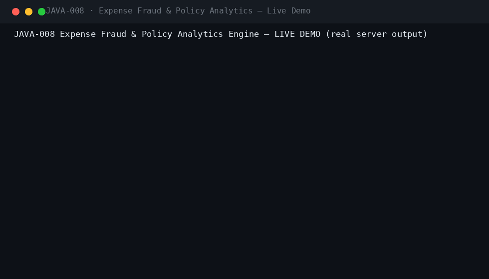
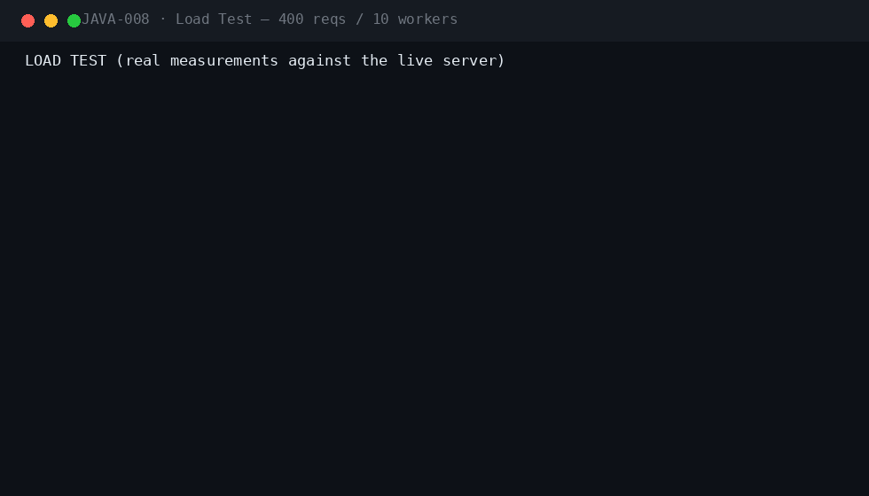
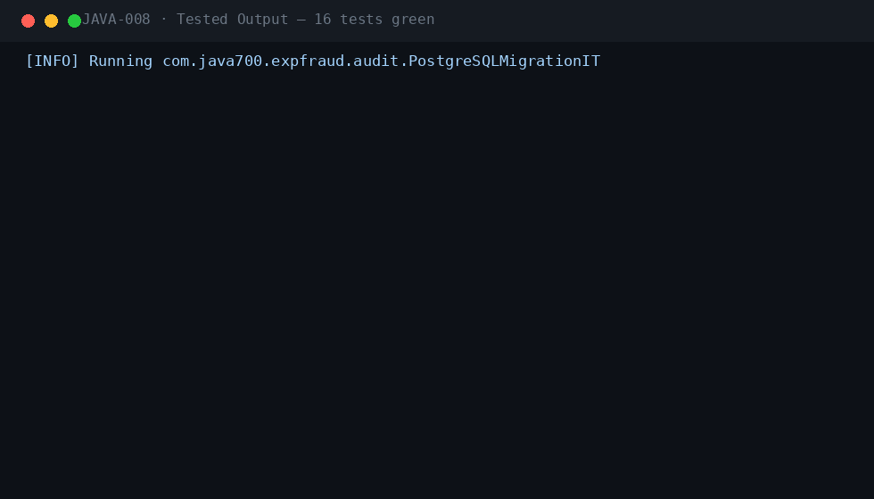

<div align="center">

#  &nbsp;Expense Fraud & Policy Analytics Engine

**JAVA-008** · Finance / Audit · Spring Boot 3.5.3 · Java 21

[](.)
[](.)
[](.)
[](.)
[](.)
[](.)
[](.)

*Explainable, policy-aware expense fraud scoring with duplicate clustering, peer-outlier analytics, four-eyes case workflow and an anonymous whistleblower channel.*

</div>

---

## 📖 What this is

| | |
|---|---|
| **Business problem** | Expense fraud — split receipts, duplicate claims, weekend mileage, fabricated round amounts — slips through manual review. Finance teams approve thousands of claims monthly with no explainable risk signal, no auditor-verifiable evidence trail, and no safe channel for employees to report wrongdoing. |
| **Engineering problem** | Build a modular-monolith scoring pipeline that combines data-driven policy rules with statistical detectors (weekend-mileage, peer z-score outliers) and graph-based duplicate/split-receipt clustering (JGraphT connected components). Every risk point must be explainable, persisted as evidence, and enforced by domain guards: high-risk claims bypass manager approval entirely and move through a two-person, four-eyes case workflow. |
| **Why it is industrial** | Production-oriented from day one: Flyway-managed schema, H2/PostgreSQL-compatible SQL, stateless JWT RBAC with method security, idempotent claim ingestion, PII masking for least-disclosure reads, audit log on every transition, Micrometer business metrics, RabbitMQ event publishing with dead-letter queues, a nightly baseline scheduler, and a CI pipeline running Checkstyle, SpotBugs and a real-PostgreSQL migration test. |

## ⚡ Quickstart

```bash
mvn spring-boot:run -Dspring-boot.run.profiles=dev     # zero dependencies
# Swagger UI → http://localhost:8080/swagger-ui.html
```

```bash
cp .env.example .env && docker compose up --build       # PostgreSQL 16 · RabbitMQ · Prometheus · Grafana
```

**Demo users** (password `Password123!`): `employee` · `manager` · `investigator` · `investigator2` · `auditor` · `admin`

## 🎬 Live demo (real server output)



The live demo walks the full fraud lifecycle: a clean meal claim is approved; weekend mileage is flagged as an anomaly; two near-identical Taj Kitchen claims cluster into an evidence group; a 350.00 Friday+Saturday mileage pair scores 85/HIGH and opens a fraud case automatically; the manager's approval attempt is rejected by the policy guard; investigator 1 recommends fraud, the four-eyes control blocks a self-confirmation, and investigator 2 confirms it — the claim becomes CONFIRMED_FRAUD. Peer baselines are recomputed live and a 247.35 meal is flagged 22 standard deviations above peers. Finally an anonymous whistleblower tip is filed with no authentication and no identity capture.

## 🏗 Architecture

flowchart LR
    subgraph Intake
        A[Employee] -->|POST /api/v1/claims| B[ClaimService<br/>validation-first + idempotency]
        T[Anonymous] -->|POST /api/v1/tips<br/>permitAll| U[TipService<br/>no identity capture]
    end
    subgraph Scoring Pipeline
        B --> C{ScoringService}
        C --> C1[Policy Rules<br/>BLOCKER 45 / VIOLATION 25 / WARNING 10]
        C --> C2[Weekend-Mileage Detector +20]
        C --> C3[Peer z-score Outlier +20/+30]
        C --> C4[JGraphT Duplicate/Split Clustering +30/+15]
        C1 & C2 & C3 & C4 --> D[Explainable Score 0-100<br/>reasons persisted as evidence]
    end
    subgraph Routing
        D -->|LOW / MEDIUM| E[Manager approve/reject]
        D -->|HIGH or BLOCKER| F[FraudCase OPEN<br/>claim locked]
    end
    subgraph Four-Eyes Workflow
        F --> G[Investigator 1: RECOMMEND]
        G --> H[Investigator 2: DECIDE<br/>must differ from reviewer]
        H -->|CONFIRM_FRAUD| I[Claim CONFIRMED_FRAUD]
        H -->|CLEAR| J[Claim APPROVED]
    end
    U --> K[Investigator review queue]
    K --> F
    style D fill:#1f6feb,color:#fff
    style F fill:#b08800,color:#fff
    style I fill:#b62324,color:#fff

## ⚡ Performance (measured on a local run)



| Metric | Value |
|---|---|
| Requests | 400 mixed GET, 10 concurrent workers |
| Result | 400/400 HTTP 200 · latency p50/p95/p99 captured in the GIF |

## 🧪 Verified test output



| Suite | Coverage |
|---|---|
| `ScoringIT` (6) | MEALS-CAP violation, weekend-mileage anomaly, round-amount warning, ATM BLOCKER auto-case, duplicate clustering evidence group, peer outlier vs recomputed baseline |
| `CaseWorkflowIT` (3) | four-eyes workflow (review → decide by different investigator), manager policy-block on high risk, cleared case approves claim, invalid transitions |
| `ClaimGuardIT` (4) | idempotent submission, manager approve/reject, validation-first 400s, PII masking for non-privileged readers |
| `TipIT` (2) | anonymous no-auth intake, role-restricted listing, double-review rejection, payload validation |
| `PostgreSQLMigrationIT` | Flyway V1–V3 on real PostgreSQL 16 (CI) |

`mvn verify -Pstatic-analysis` → **Checkstyle clean · SpotBugs 0 bugs**.

## 🔐 Security model

| Control | Implementation |
|---|---|
| Authentication | Stateless JWT (HMAC-SHA256), Argon2 password hashing, account lockout after 5 failures |
| Authorization | Spring method security — `@PreAuthorize` role matrix per endpoint (EMPLOYEE / MANAGER / FRAUD_INVESTIGATOR / AUDITOR / ADMIN) |
| Four-eyes | Fraud decisions require two distinct investigators; self-confirmation returns 409 |
| Policy guard | High-risk (≥ 65) or BLOCKER claims are unapprovable by managers — case workflow only |
| PII masking | Employee names masked for non-privileged roles; AUDITOR/INVESTIGATOR/ADMIN see full evidence |
| Whistleblower channel | Anonymous intake (permitAll), no submitter identity recorded, tip number as tracking reference |
| Idempotency | `Idempotency-Key` guarded claim submission; duplicate submits replay the original resource |
| Rate limiting | Per-endpoint request throttling (auth 10/min default; configurable) |
| Audit trail | Every transition recorded (submit, score, approve, case open/review/decide, tip, rule toggle) |
| Least-disclosure reads | Shared views mask identity; evidence endpoints restricted to investigators/auditors |

Plus: JWT + Argon2id local IdP with lockout · Idempotency-Key on every mutation · RFC 7807 errors with correlation IDs · full audit trail · threat model in `docs/SECURITY.md`.

## 🗂 Repository

```
projects/java-008/
├── src/main/java/com/java700/expfraud/
│   ├── api/            ClaimController · CaseController · TipController · AdminController
│   ├── domain/         7 JPA entities + repositories (expense_claims, policy_rules, rule_violations,
│   │                   duplicate_groups, fraud_cases, tips, peer_baselines)
│   ├── service/        ScoringService (rules + detectors + JGraphT clustering) · CaseService (four-eyes)
│   │                   ClaimService (policy guard) · TipService · BaselineService · BaselineScheduler · Api records
│   ├── security/       JWT RBAC · Roles · local IdP (Argon2) · lockout
│   ├── messaging/      Domain events (ClaimSubmitted/Scored, CaseOpened/Decided) · RabbitMQ + DLX
│   ├── observability/  Micrometer counters, risk-score distribution, scoring timer
│   └── bootstrap/      dev seed (6 role accounts) · OpenAPI
├── src/main/resources/db/migration/   V1 common · V2 expfraud schema · V3 policy rules seed
├── src/test/java/      ScoringIT · CaseWorkflowIT · ClaimGuardIT · TipIT · PostgreSQLMigrationIT
├── docs/               demo.gif · perf.gif · tests.gif · logo.png · ARCHITECTURE · SECURITY · RUNBOOK
│                       · TESTING · DEPLOYMENT · CONFIGURATION · TROUBLESHOOTING · ADRs
├── docker/  · docker-compose.yml (app + PostgreSQL 16 + RabbitMQ) · Dockerfile · jmeter/plan.jmx
└── .github/workflows/ci.yml   (build → checkstyle → spotbugs → tests → Postgres migration IT)
```

## 🧰 Engineering highlights

- **Explainable scoring** — every risk point carries a code, weight and human-readable reason persisted on the claim — auditors can re-derive any score
- **JGraphT duplicate clustering** — claims of one employee at one merchant become a similarity graph; connected components ≥ 2 become persisted evidence groups with match confidence
- **Four-eyes case workflow** — OPEN → REVIEWED → CONFIRMED_FRAUD/CLEARED with a hard rule that the decider differs from the reviewer
- **Manager policy guard** — high-risk or BLOCKER claims are locked out of manager approval and routed to investigators automatically
- **Peer baselines** — nightly recompute of mean/median/p90/std-dev per department+category powers z-score outlier detection (≥ 5 samples)
- **Anonymous whistleblowing** — open intake endpoint with zero identity capture, tip numbers as follow-up references
- **Observability** — business metrics (claims scored, cases opened/decided, tips, clusters) + scoring duration timer exposed via Prometheus

---

<div align="center">

**Part of the [Java-700 portfolio](https://github.com/Madanpatel21/Java-Project-portfolio)** — 700 unique industrial-grade Java systems.

</div>
