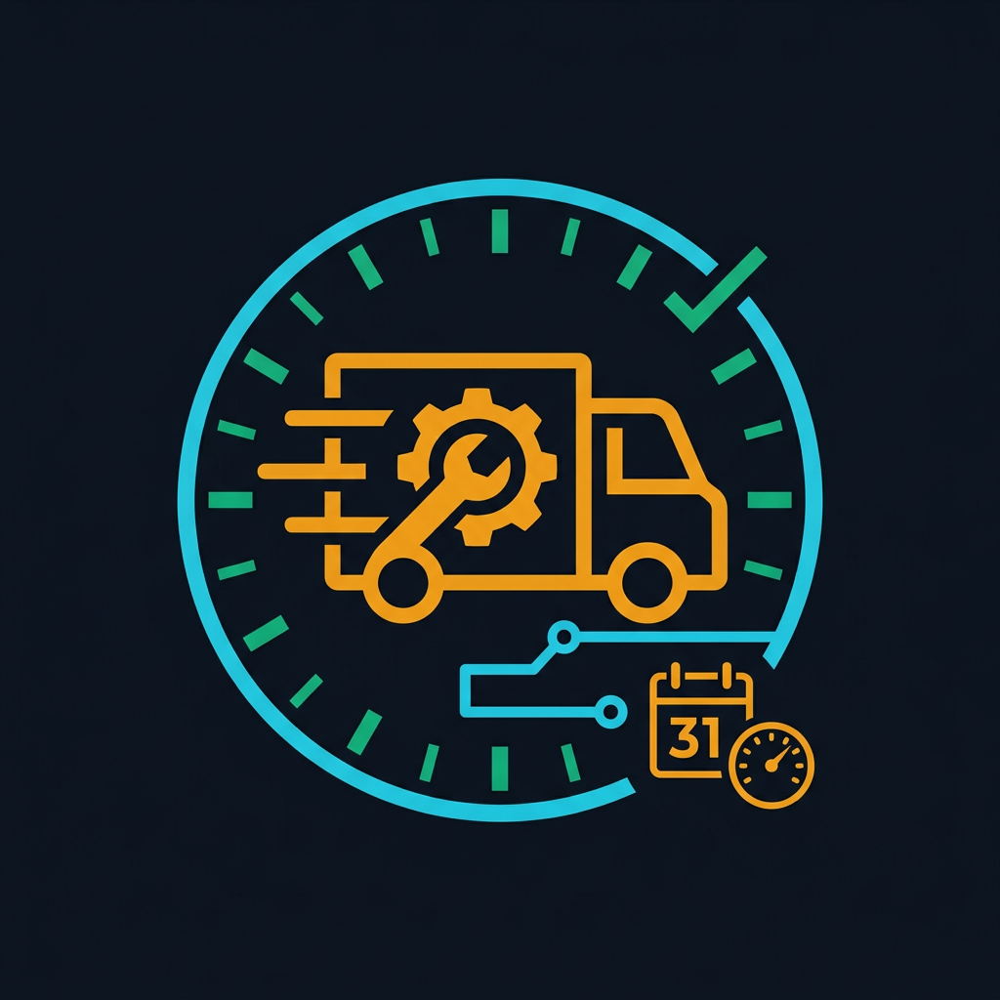
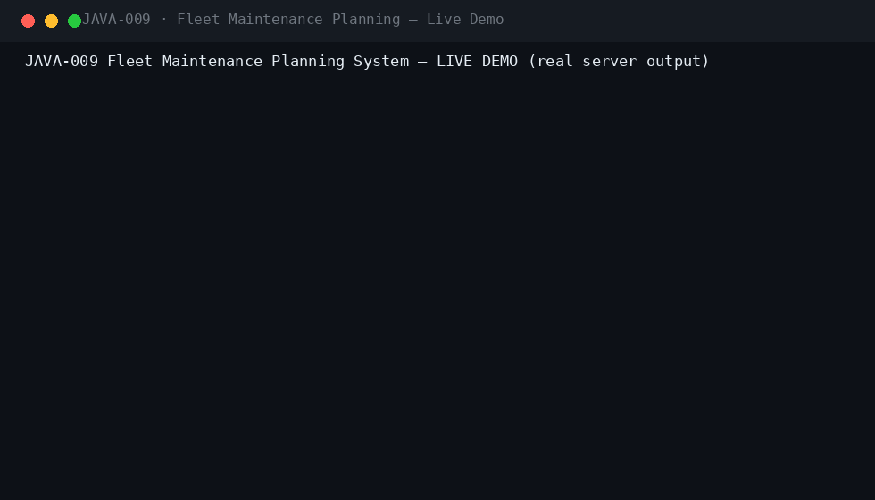
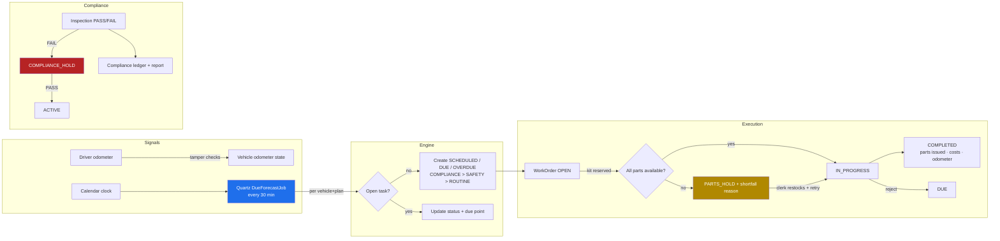
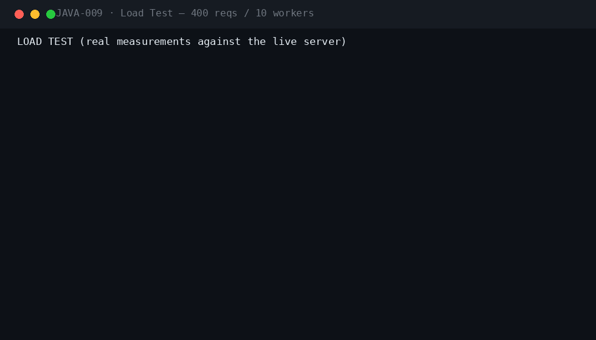
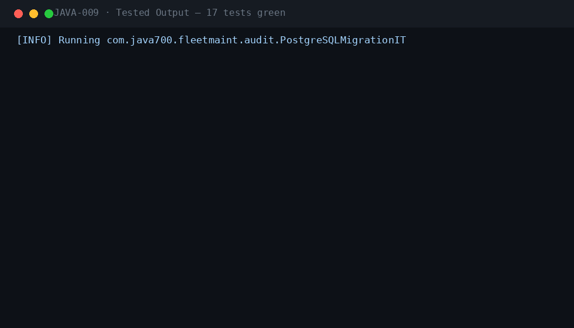

<div align="center">

#  &nbsp;Fleet Maintenance Planning System

**JAVA-009** · Enterprise Fleet · Spring Boot 3.5.3 · Java 21

[](.)
[](.)
[](.)
[](.)
[](.)
[](.)
[](.)

*Meter/calendar-based service scheduling, work-order lifecycle with parts kitting, odometer tamper detection and a compliance inspection ledger — with cost analytics per asset.*

</div>

---

## 📖 What this is

| | |
|---|---|
| **Business problem** | Unscheduled downtime and compliance violations from missed inspections on company vehicles. Fleets run on scattered spreadsheets: odometer readings arrive late or tampered, service intervals slip, parts arrive after the truck is already on the lift, and no one can prove to the regulator that inspections happened on time. |
| **Engineering problem** | Build a scheduling engine that derives due services from two independent signals (odometer meters and calendar dates) and maintains exactly one open task per vehicle+plan. Add a work-order lifecycle whose parts kits reserve real inventory (with PARTS_HOLD on shortfall), an odometer ingestion path that rejects rollbacks and flags physically impossible jumps, and a compliance ledger that puts vehicles on COMPLIANCE_HOLD after a failed inspection. |
| **Why it is industrial** | Production-oriented from day one: Quartz-driven forecasting, Spring Data JPA with Flyway-managed schema, stateless JWT RBAC across seven roles (driver, fleet manager, mechanic, parts clerk, compliance officer, auditor, admin), full audit trail, RabbitMQ domain events with dead-letter queues, Micrometer metrics, cost-per-asset analytics, and a CI pipeline running Checkstyle, SpotBugs and a real-PostgreSQL migration test. |

## ⚡ Quickstart

```bash
mvn spring-boot:run -Dspring-boot.run.profiles=dev     # zero dependencies
# Swagger UI → http://localhost:8080/swagger-ui.html
```

```bash
cp .env.example .env && docker compose up --build       # PostgreSQL 16 · RabbitMQ · Prometheus · Grafana
```

**Demo users** (password `Password123!`): `driver` · `fleet` · `mechanic` · `clerk` · `compliance` · `auditor` · `admin`

## 🎬 Live demo (real server output)



The live demo walks a full maintenance cycle: a truck is registered with 98,500 km and service-history anchors; a rolled-back odometer reading is rejected with HTTP 409; a +20,000 km impossible jump is accepted but flagged SUSPICIOUS_JUMP; the forecast engine creates four tasks (DOT annual OVERDUE/COMPLIANCE, brake DUE, oil OVERDUE, tyres OVERDUE); a work order is opened for the oil change and its parts kit is reserved from stock, then completed (parts issued, costs recorded, task closed); a second work order reserves the brake kit; a failed DOT inspection puts the vehicle on COMPLIANCE_HOLD and the compliance report shows non-compliant; a PASS releases the hold; the auditor finally reads fleet-wide stats including cost-per-asset.

## 🏗 Architecture



## ⚡ Performance (measured on a local run)



| Metric | Value |
|---|---|
| Requests | 400 mixed GET, 10 concurrent workers |
| Result | 400/400 HTTP 200 · latency p50/p95/p99 captured in the GIF |

## 🧪 Verified test output



| Suite | Coverage |
|---|---|
| `ForecastIT` (4) | meter+calendar due/overdue tasks with correct priorities, idempotent per vehicle+plan, odometer-driven overdue flip, RBAC |
| `OdometerIT` (4) | rollback rejection, suspicious-jump flagging, normal acceptance, role boundaries |
| `WorkOrderIT` (4) | parts reservation → issue on completion, PARTS_HOLD on shortfall + restock retry, rejection releases reservations, RBAC |
| `ComplianceIT` (4) | COMPLIANCE_HOLD on FAIL, release on PASS, compliance report, overdue compliance forecasting |
| `PostgreSQLMigrationIT` | Flyway V1–V3 on real PostgreSQL 16 (CI) |

`mvn verify -Pstatic-analysis` → **Checkstyle clean · SpotBugs 0 bugs**.

## 🔐 Security model

| Control | Implementation |
|---|---|
| Authentication | Stateless JWT (HMAC-SHA256), Argon2 password hashing, account lockout after 5 failures |
| Authorization | `@PreAuthorize` role matrix: DRIVER / FLEET_MANAGER / MECHANIC / PARTS_CLERK / COMPLIANCE_OFFICER / AUDITOR / ADMIN |
| Odometer tamper detection | Readings below the last recorded value are rejected (409); implausible jumps are accepted but flagged SUSPICIOUS_JUMP for review |
| Compliance guard | FAILED inspection → vehicle COMPLIANCE_HOLD; only a subsequent PASS releases it |
| Inventory integrity | Reservations deduct from available stock atomically; shortfalls park the work order instead of over-issuing |
| Audit trail | Every transition recorded: registration, odometer events, forecast runs, WO lifecycle, restocks, inspections |
| Rate limiting | Per-endpoint request throttling (auth 10/min default; configurable) |
| Idempotency | Idempotency-Key support on create endpoints; forecast is naturally idempotent per vehicle+plan |
| Least privilege | Drivers see only their readings; parts costs visible to clerks/managers/auditors only |

Plus: JWT + Argon2id local IdP with lockout · Idempotency-Key on every mutation · RFC 7807 errors with correlation IDs · full audit trail · threat model in `docs/SECURITY.md`.

## 🗂 Repository

```
projects/java-009/
├── src/main/java/com/java700/fleetmaint/
│   ├── api/            VehicleController · PlanController · SchedulingController · WorkOrderController
│   │                   InventoryController · InspectionController · StatsController
│   ├── domain/         9 JPA entities + repositories (vehicles, maintenance_plans, plan_items,
│   │                   maintenance_tasks, work_orders, parts, part_reservations, inspections,
│   │                   odometer_entries)
│   ├── service/        ForecastService (scheduling engine) · WorkOrderService (lifecycle + kitting)
│   │                   VehicleService (tamper checks) · InspectionService · InventoryService
│   │                   PlanService · StatsService · Api records
│   ├── scheduling/     Quartz DueForecastJob + QuartzConfig (autowiring job factory, cron trigger)
│   ├── security/       JWT RBAC · Roles · local IdP (Argon2) · lockout
│   ├── messaging/      FleetEvents (ServiceDue/TamperFlagged/WorkOrderCompleted/InspectionFailed) · RabbitMQ + DLX
│   ├── observability/  Micrometer counters (tasks forecasted/overdue, WOs, parts issued, tamper flags)
│   └── bootstrap/      dev seed (7 role accounts) · OpenAPI
├── src/main/resources/db/migration/   V1 common · V2 fleet schema · V3 plans/parts seed
├── src/test/java/      ForecastIT · OdometerIT · WorkOrderIT · ComplianceIT · PostgreSQLMigrationIT
├── docs/               demo.gif · perf.gif · tests.gif · logo.png · ARCHITECTURE · SECURITY · RUNBOOK
│                       · TESTING · DEPLOYMENT · CONFIGURATION · TROUBLESHOOTING · ADRs
├── docker/  · docker-compose.yml (app + PostgreSQL 16 + RabbitMQ) · Dockerfile · jmeter/plan.jmx
└── .github/workflows/ci.yml   (build → checkstyle → spotbugs → tests → Postgres migration IT)
```

## 🧰 Engineering highlights

- **Quartz scheduling engine** — meter and calendar intervals fused per vehicle+plan; one idempotent open task each, prioritised COMPLIANCE > SAFETY > ROUTINE
- **Odometer tamper detection** — rollbacks rejected outright; physically impossible jumps accepted but flagged SUSPICIOUS_JUMP with a full history ledger
- **Parts kitting & reservations** — work orders reserve real inventory from plan kits; shortfalls park the order on PARTS_HOLD until restock
- **Compliance ledger** — FAIL → COMPLIANCE_HOLD, PASS → release; a live report joins every vehicle to its latest inspection and validity window
- **Cost analytics per asset** — completed work orders roll up into per-vehicle totals (parts + labor) for whole-life costing
- **Seven-role RBAC** — driver, fleet manager, mechanic, parts clerk, compliance officer, auditor and admin with method-level enforcement
- **Event-driven integration** — ServiceDue, TamperFlagged, WorkOrderCompleted and InspectionFailed events fan out over RabbitMQ with DLX

---

<div align="center">

**Part of the [Java-700 portfolio](https://github.com/Madanpatel21/Java-Project-portfolio)** — 700 unique industrial-grade Java systems.

</div>
