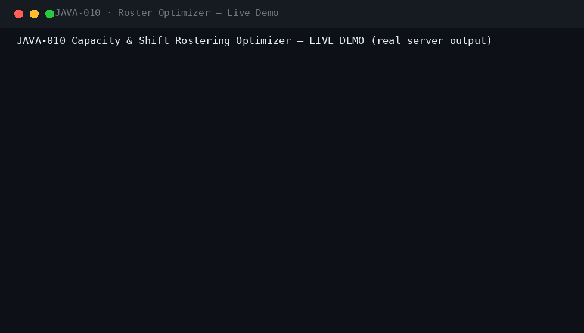
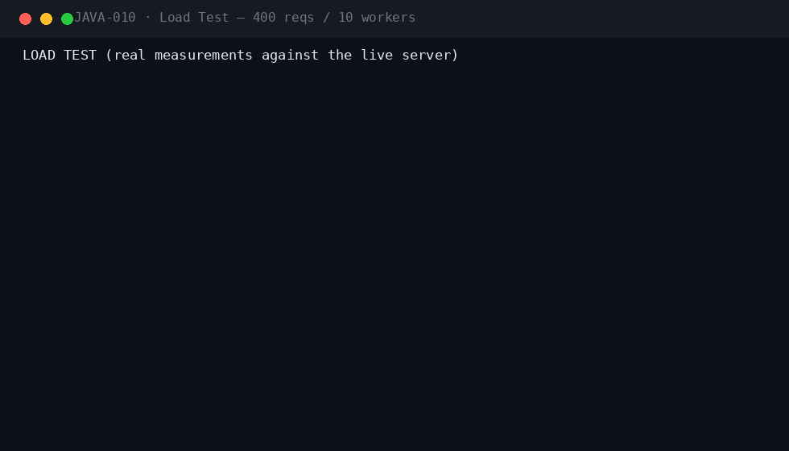
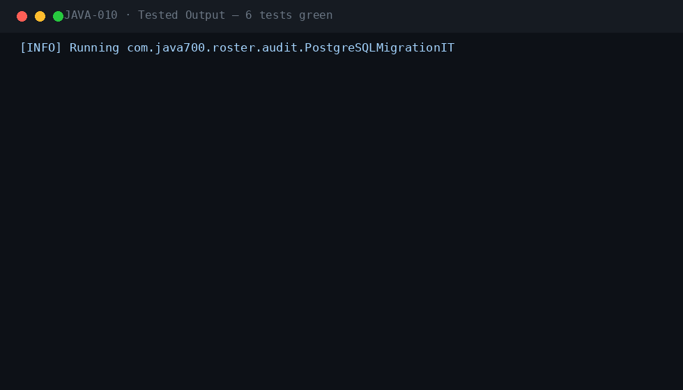

<div align="center">

#  &nbsp;Capacity & Shift Rostering Optimizer

**JAVA-010** · Workforce Management · Spring Boot 3.5.3 · Java 21

[](.)
[](.)
[](.)
[](.)
[](.)
[](.)
[](.)

*Constraint-based workforce rostering with Timefold Solver: labor-law hard constraints, fairness scoring, explainable score breakdowns, self-service schedules and manager-approved shift swaps.*

</div>

---

## 📖 What this is

| | |
|---|---|
| **Business problem** | Scheduling staff to demand curves while respecting labor law, skills, fatigue and fairness. Manual rostering produces overtime violations, exhausted employees on night runs, unfair hour distributions — and no defensible evidence when a regulator asks how the roster was built. |
| **Engineering problem** | Model rostering as a constraint-satisfaction problem: every demand slot is a planning entity, every employee a planning variable value. Timefold Solver optimizes against hard constraints (skill match, availability, one shift per day, weekly hour caps, 11h rest after nights, max 6 working days, night caps) and soft objectives (coverage, squared-hours fairness). Scores must be explainable, persisted and re-derivable by auditors. |
| **Why it is industrial** | Production-oriented: Flyway-managed schema on H2/PostgreSQL, JWT RBAC (EMPLOYEE/MANAGER/ADMIN/AUDITOR), full audit trail, RabbitMQ events with dead-letter queues, Micrometer metrics, publish lifecycle that refuses rosters with uncovered slots, swap workflow with re-validation at approval, and CI running Checkstyle, SpotBugs and a real-PostgreSQL migration test. |

## ⚡ Quickstart

```bash
mvn spring-boot:run -Dspring-boot.run.profiles=dev     # zero dependencies
# Swagger UI → http://localhost:8080/swagger-ui.html
```

```bash
cp .env.example .env && docker compose up --build       # PostgreSQL 16 · RabbitMQ · Prometheus · Grafana
```

**Demo users** (password `Password123!`): `employee` · `manager` · `admin` · `auditor`

## 🎬 Live demo (real server output)



The live demo creates a 7-day, 21-slot roster from a demand curve, runs the Timefold optimizer for 5 seconds and lands on a feasible solution (0 hard violations, full coverage). The auditor reads the per-constraint explanation (fairness weight 5,824 soft — the squared-hours balancer). The employee sees their own schedule, requests a swap with a NURSE-qualified peer, and the manager approves it with re-validation. Stats show 100% coverage and a 5.99h fairness std-dev, then the roster is published.

## 🏗 Architecture

flowchart LR
    subgraph Inputs
        E[Employees + skills + caps] --> S
        D[Demand curve<br/>MORNING/AFTERNOON/NIGHT] --> R[Roster DRAFT<br/>21 shift slots]
        A[Availabilities<br/>leave/training] --> S
    end
    subgraph Solver
        R --> S[Timefold Solver<br/>5s termination]
        S --> C{Hard constraints}
        C --> C1[Skill match]
        C --> C2[One shift / employee / day]
        C --> C3[Weekly hours <= 40]
        C --> C4[11h rest after NIGHT]
        C --> C5[Max 6 days / week]
        C --> C6[Night cap <= 4]
        C1 & C2 & C3 & C4 & C5 & C6 --> F[Feasible 0hard]
        S --> O{Soft objectives}
        O --> O1[Coverage: staff every slot]
        O --> O2[Fairness: balance hours]
    end
    subgraph Lifecycle
        F --> X[Persist assignments + score]
        X -->|full coverage| P[Publish roster]
        X --> SW[Self-service schedules]
        SW -->|swap request| M[Manager approval<br/>re-validated]
    end
    style S fill:#1f6feb,color:#fff
    style F fill:#1a7f37,color:#fff
    style P fill:#1a7f37,color:#fff

## ⚡ Performance (measured on a local run)



| Metric | Value |
|---|---|
| Requests | 400 mixed GET, 10 concurrent workers |
| Result | 400/400 HTTP 200 · latency p50/p95/p99 captured in the GIF |

## 🧪 Verified test output



| Suite | Coverage |
|---|---|
| `SolverIT` (2) | feasible full-coverage solve with skill matches, constraint explanations, publish gate (409 before optimize, 200 after) |
| `SwapIT` (3) | request→approve moves the assignment, reject keeps it, skill mismatch fails fast, employees cannot decide swaps or create rosters |
| `PostgreSQLMigrationIT` | Flyway V1–V3 on real PostgreSQL 16 (CI) |

`mvn verify -Pstatic-analysis` → **Checkstyle clean · SpotBugs 0 bugs**.

## 🔐 Security model

| Control | Implementation |
|---|---|
| Authentication | Stateless JWT (HMAC-SHA256), Argon2 password hashing, account lockout after 5 failures |
| Authorization | `@PreAuthorize` matrix: EMPLOYEE (self-service), MANAGER (roster lifecycle + swaps), ADMIN, AUDITOR (read-only) |
| Swap re-validation | Approvals re-check skill, availability and double-booking at decision time — stale requests cannot pass |
| Publish gate | Rosters with uncovered slots or missing scores cannot be published (HTTP 409) |
| Least privilege | Employees see only their own schedule and swap requests |
| Audit trail | Every transition recorded: roster create/optimize/publish, swaps requested/decided |
| Rate limiting | Per-endpoint throttling (auth 10/min default; configurable) |
| Validation-first | Demand templates, shift types and employee payloads validated before persistence |

Plus: JWT + Argon2id local IdP with lockout · Idempotency-Key on every mutation · RFC 7807 errors with correlation IDs · full audit trail · threat model in `docs/SECURITY.md`.

## 🗂 Repository

```
projects/java-010/
├── src/main/java/com/java700/roster/
│   ├── api/            RosterController · EmployeeController · MyScheduleController · SwapController
│   ├── domain/         7 JPA entities + repositories (employees, availabilities, rosters, shifts,
│   │                   shift_assignments, roster_rules, swap_requests)
│   ├── solver/         RosterSolution (@PlanningSolution) · PlannedShift (@PlanningEntity)
│   │                   RosterConstraintProvider (9 constraints: 7 hard + coverage + fairness)
│   ├── service/        SolverService (Timefold integration + explanations) · RosterService
│   │                   SwapService · StatsService · Api records
│   ├── security/       JWT RBAC · Roles · local IdP (Argon2) · lockout
│   ├── messaging/      RosterEvents (Published/Optimized/SwapApproved) · RabbitMQ + DLX
│   ├── observability/  Micrometer (rosters optimized/published, swaps, solver duration)
│   └── bootstrap/      dev seed (4 role accounts + 5 workforce employees) · OpenAPI
├── src/main/resources/db/migration/   V1 common · V2 roster schema · V3 labor rules seed
├── src/test/java/      SolverIT · SwapIT · PostgreSQLMigrationIT
├── docs/               demo.gif · perf.gif · tests.gif · logo.png · ARCHITECTURE · SECURITY · RUNBOOK
│                       · TESTING · DEPLOYMENT · CONFIGURATION · TROUBLESHOOTING · ADRs
├── docker/  · docker-compose.yml (app + PostgreSQL 16 + RabbitMQ) · Dockerfile · jmeter/plan.jmx
└── .github/workflows/ci.yml   (build → checkstyle → spotbugs → tests → Postgres migration IT)
```

## 🧰 Engineering highlights

- **Timefold constraint programming** — 7 hard labor-law constraints + coverage and squared-hours fairness objectives, solved to feasibility in seconds
- **Explainable scores** — every score is re-derivable: constraint-match totals with counts are persisted on the roster and exposed to auditors
- **Fairness metrics** — squared-hours minimization balances weekly load; std-dev analytics show the distribution per employee
- **Swap workflow with re-validation** — approvals re-check skill, availability and double-booking at decision time — requests can't go stale
- **Publish gate** — rosters with uncovered slots or missing optimization cannot be published
- **Self-service portal** — employees see only their own shifts and swap requests; managers keep the global view
- **Deterministic CI** — solver runs in REPRODUCIBLE environment mode with per-environment time limits

---

<div align="center">

**Part of the [Java-700 portfolio](https://github.com/Madanpatel21/Java-Project-portfolio)** — 700 unique industrial-grade Java systems.

</div>
