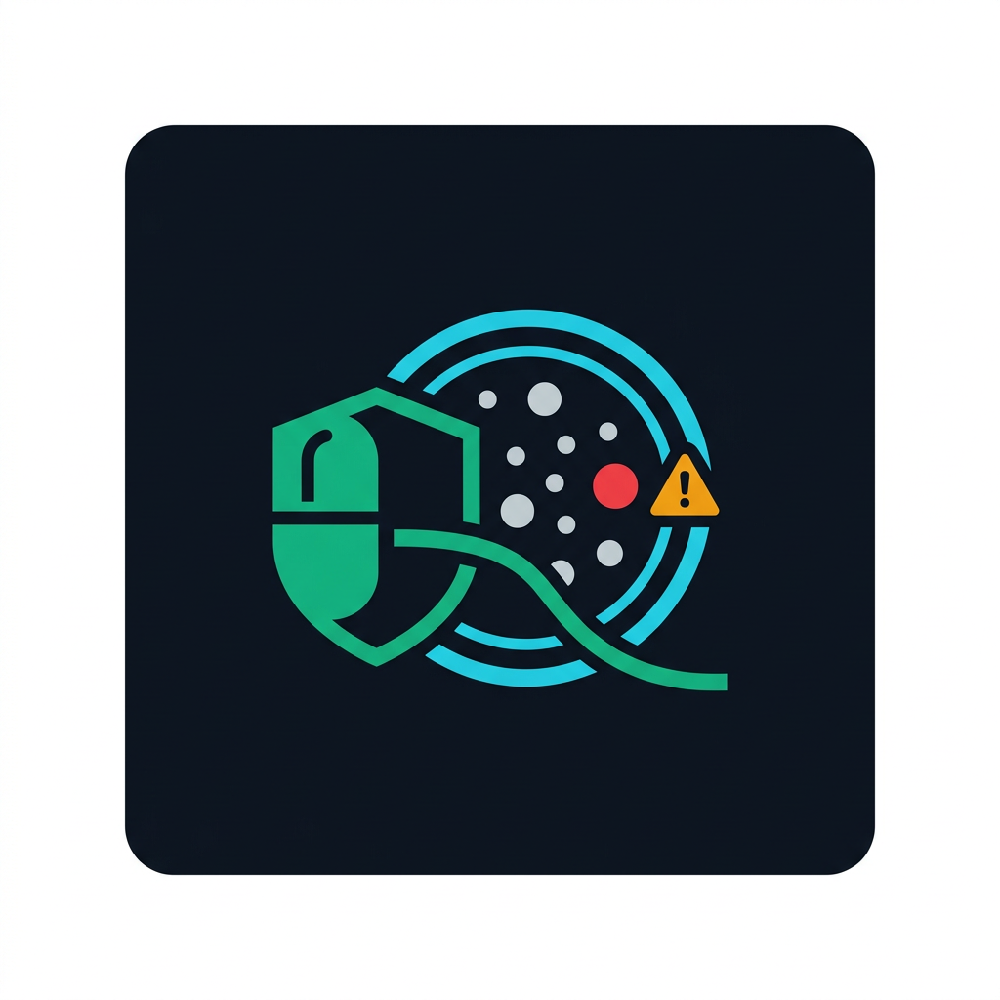
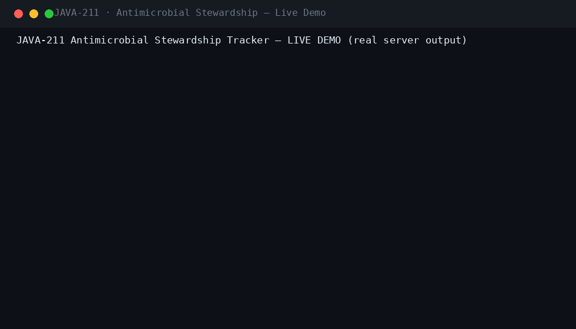
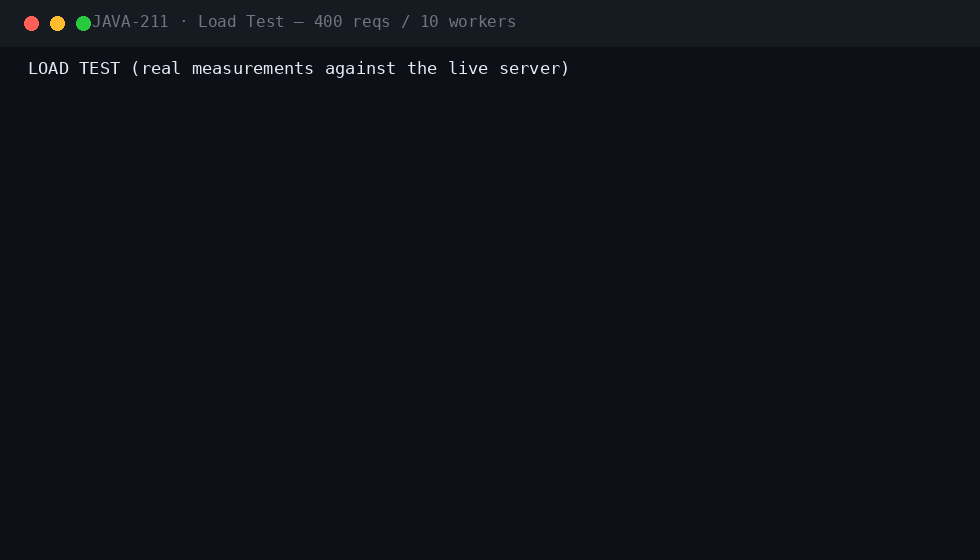
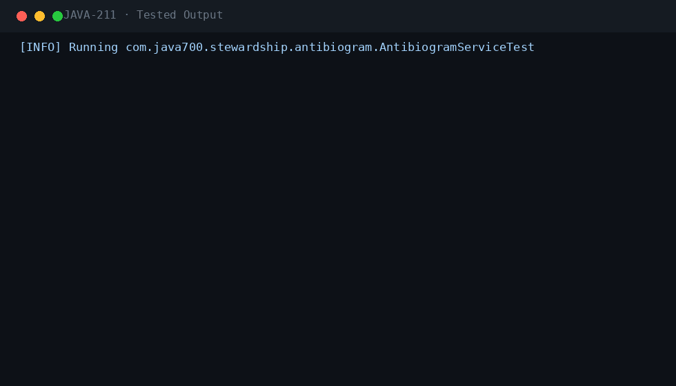

<div align="center">

#  &nbsp;Antimicrobial Stewardship Tracker

**JAVA-211** · Healthcare / Pharma · Spring Boot 3.5.3 · Java 21

[](.)
[](.)
[](.)
[](.)
[](.)
[](.)
[](.)

*Guideline-driven antimicrobial review, culture-driven drug–bug mismatch alerts, renal dose adjustments, time-boxed pre-authorization for restricted drugs, and utilization analytics (DOT/DDD, antibiograms) — hospital-grade stewardship with auditability.*

</div>

---

## 📖 What this is

| | |
|---|---|
| **Business problem** | Antimicrobial misuse and delayed de-escalation drive antimicrobial resistance and poor outcomes. Pharmacists review charts by hand, restricted drugs slip through without ID sign-off, and nobody can report DOT/DDD or cumulative susceptibility when the regulators ask. |
| **Engineering problem** | Automate the stewardship loop: a typed rule engine evaluates every active prescription against guidelines (IV→PO eligibility, renal dosing via Cockcroft-Gault, max duration, redundant coverage), culture susceptibility results (drug–bug mismatch, de-escalation candidates), and generates time-boxed review tasks and pharmacist interventions with a prescriber acceptance workflow. |
| **Why it is industrial** | Hospital-grade design: WHO DDD-aligned drug catalog seeded via Flyway, Cockcroft-Gault renal calculator, six clinical roles with method-level RBAC, idempotent ordering, review-task scheduler, audit trail on every clinical transition, RabbitMQ events with in-process fallback, Prometheus metrics, and CI running Checkstyle, SpotBugs and a real-PostgreSQL migration test. |

## ⚡ Quickstart

```bash
mvn spring-boot:run -Dspring-boot.run.profiles=dev     # zero dependencies
# Swagger UI → http://localhost:8080/swagger-ui.html
```

```bash
cp .env.example .env && docker compose up --build       # PostgreSQL 16 · RabbitMQ · Prometheus · Grafana
```

**Demo users** (password `Password123!`): `pharmacist` · `prescriber` · `idphysician` · `microbiologist` · `infectioncontrol` · `admin`

## 🎬 Live demo (real server output)



The live demo walks a full stewardship scenario on the seeded ICU patient: the microbiologist reports a blood culture with E. coli resistant to ceftriaxone; the pharmacist's evaluation flags a CRITICAL drug–bug mismatch and an IV-to-PO switch candidate; pip-tazo evaluation warns of a renal adjustment (creatinine 2.1 → CrCl ≈ 25 mL/min, extend to Q12H); a duplicate backdated metronidazole order demonstrates the redundant-anaerobic-coverage rule firing only past the 24-hour overlap threshold; review tasks are assigned and completed; a pharmacist IV→PO intervention is accepted by the prescriber; ordering restricted MEROPENEM creates a PENDING pre-authorization which the ID physician approves; and infection control reads ward-level DOT/DDD metrics plus the cumulative antibiogram.

## 🏗 Architecture

flowchart LR
    subgraph Clinical Inputs
        O[Prescriber orders<br/>antimicrobial] --> R[Rx ACTIVE]
        L[Labs: creatinine] --> E
        C[Microbiologist isolates<br/>+ susceptibility] --> E
    end
    subgraph Stewardship Engine
        R --> E[StewardshipRuleEngine]
        E --> F1[DURATION_EXCEEDED]
        E --> F2[IV_TO_PO_ELIGIBLE]
        E --> F3[RENAL_ADJUSTMENT<br/>Cockcroft-Gault]
        E --> F4[DRUG_BUG_MISMATCH]
        E --> F5[REDUNDANT_COVERAGE<br/>>24h overlap]
        E --> F6[DE_ESCALATION_CANDIDATE]
    end
    subgraph Actions
        F1 & F2 & F3 & F4 & F5 & F6 --> T[Review tasks due-first]
        T --> P[Pharmacist intervention]
        P -->|accept| A[Therapy changed]
        R -->|restricted drug| G[Pre-authorization PENDING]
        G -->|ID physician| AP[APPROVED]
    end
    subgraph Reporting
        R --> M[DOT / DDD per ward]
        C --> AB[Antibiogram %S/%I/%R]
    end
    style E fill:#1f6feb,color:#fff
    style F4 fill:#b62324,color:#fff
    style F3 fill:#b08800,color:#fff
    style M fill:#1a7f37,color:#fff

## ⚡ Performance (measured on a local run)



| Metric | Value |
|---|---|
| Requests | 400 mixed GET, 10 concurrent workers |
| Result | 400/400 HTTP 200 · latency p50/p95/p99 captured in the GIF |

## 🧪 Verified test output



| Suite | Coverage |
|---|---|
| `StewardshipRuleEngineTest` | all 6 finding types: duration, IV→PO, renal (Cockcroft-Gault), drug–bug mismatch, redundant coverage threshold, de-escalation |
| `RenalCalculatorTest` | Cockcroft-Gault edge cases (age, weight, sex, creatinine) |
| `UtilizationMetricsTest` (8) | DOT, patient-days, DOT/1000PD, DDD conversions per ward |
| `PrescriptionFlowIT` | order → activate → stop lifecycle, restricted pre-authorization gate |
| `StewardshipWorkflowIT` | review task creation/assign/complete, intervention propose/accept/reject, RBAC matrix |
| `MicrobiologyIT` | isolate entry, susceptibility rows, culture report triggers evaluation |
| `PostgreSQLMigrationIT` | Flyway V1–V2 on real PostgreSQL 16 (CI) |

`mvn verify -Pstatic-analysis` → **Checkstyle clean · SpotBugs 0 bugs**.

## 🔐 Security model

| Control | Implementation |
|---|---|
| Authentication | Stateless JWT (HMAC-SHA256), Argon2 password hashing, account lockout |
| Authorization | Six clinical roles with `@PreAuthorize` (PHARMACIST, PRESCRIBER, ID_PHYSICIAN, MICROBIOLOGIST, INFECTION_CONTROL, STEWARDSHIP_ADMIN) |
| Restricted drugs | Ordering a restricted drug yields PENDING_AUTHORIZATION; therapy is not active until an ID physician approves |
| Clinical integrity | Interventions require ACTIVE prescriptions; rejections require a clinical reason; findings are re-derivable from labs + cultures |
| Idempotency | `Idempotency-Key` on prescription orders and interventions — replays return the original resource |
| PII masking | Patient MRN and name masked (`MR***01`, `Ad***ce`) in list/search responses |
| Audit trail | Every clinical transition recorded: orders, stops, reviews, interventions, pre-auth decisions |
| Rate limiting | Per-endpoint throttling (auth 10/min default; configurable) |
| Validation-first | Payload validation before persistence; unknown intervention types rejected |

Plus: JWT + Argon2id local IdP with lockout · Idempotency-Key on every mutation · RFC 7807 errors with correlation IDs · full audit trail · threat model in `docs/SECURITY.md`.

## 🗂 Repository

```
projects/java-211/
├── src/main/java/com/java700/stewardship/
│   ├── prescriptions/   Order → ACTIVATE → STOP lifecycle, restricted pre-auth gate
│   ├── guidelines/      StewardshipRuleEngine (6 typed findings) · RenalCalculator (Cockcroft-Gault)
│   │                    · GuidelineService (versioned rule sets)
│   ├── reviews/         ReviewTask queue (due-first) · assign/complete · StewardshipEvaluation
│   │                    · scheduled review scanner
│   ├── interventions/   Pharmacist propose → prescriber accept/reject (7 types)
│   ├── microbiology/    Cultures · isolates · susceptibility rows · report triggers evaluation
│   ├── restricted/      Restricted-drug authorizations (PENDING → APPROVED/REJECTED)
│   ├── metrics/         DOT / DDD / per-1000-patient-days utilization per ward
│   ├── antibiogram/     Cumulative %S/%I/%R with minimum-isolate thresholds
│   ├── patients/        Patients · admissions · lab values (masked PII)
│   ├── catalog/         WHO DDD-aligned antimicrobial catalog
│   ├── security/        JWT RBAC · Argon2 local IdP · lockout
│   └── bootstrap/       dev seed (6 roles + ICU/MED scenario with deliberate findings)
├── src/main/resources/db/migration/   V1 init schema · V2 catalog + guidelines seed
├── src/test/java/      RuleEngine, RenalCalculator, UtilizationMetrics, workflow + micro ITs
├── docs/               demo.gif · perf.gif · tests.gif · logo.png · ARCHITECTURE · SECURITY · RUNBOOK
│                       · TESTING · DEPLOYMENT · CONFIGURATION · TROUBLESHOOTING · ADRs
├── docker/  · docker-compose.yml (app + PostgreSQL + RabbitMQ) · Dockerfile · jmeter/plan.jmx
└── .github/workflows/ci.yml   (build → checkstyle → spotbugs → tests → Postgres migration IT)
```

## 🧰 Engineering highlights

- **Typed stewardship rule engine** — six clinical finding types evaluated per prescription — duration, IV→PO, renal, mismatch, redundant coverage, de-escalation
- **Culture-driven alerts** — susceptibility rows flip therapy recommendations the moment a culture is reported (CRITICAL drug–bug mismatch)
- **Cockcroft-Gault renal dosing** — lab creatinine + age/weight/sex produce CrCl-based dose-adjustment advice (Q12H below 40 mL/min)
- **Restricted-drug pre-authorization** — carbapenems and glycopeptides stay PENDING until an ID physician approves
- **Pharmacist intervention workflow** — 7 intervention types, propose → accept/reject with mandatory clinical reasons on rejection
- **Utilization analytics** — DOT, DDD and DOT/1000-patient-days per ward; cumulative antibiograms with isolate thresholds
- **Scheduled review scanner** — time-boxed review tasks auto-created from findings — nothing stays un-reviewed

---

<div align="center">

**Part of the [Java-700 portfolio](https://github.com/Madanpatel21/Java-Project-portfolio)** — 700 unique industrial-grade Java systems.

</div>
