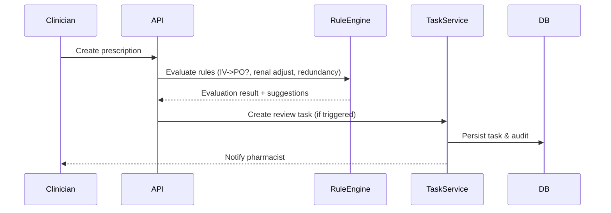
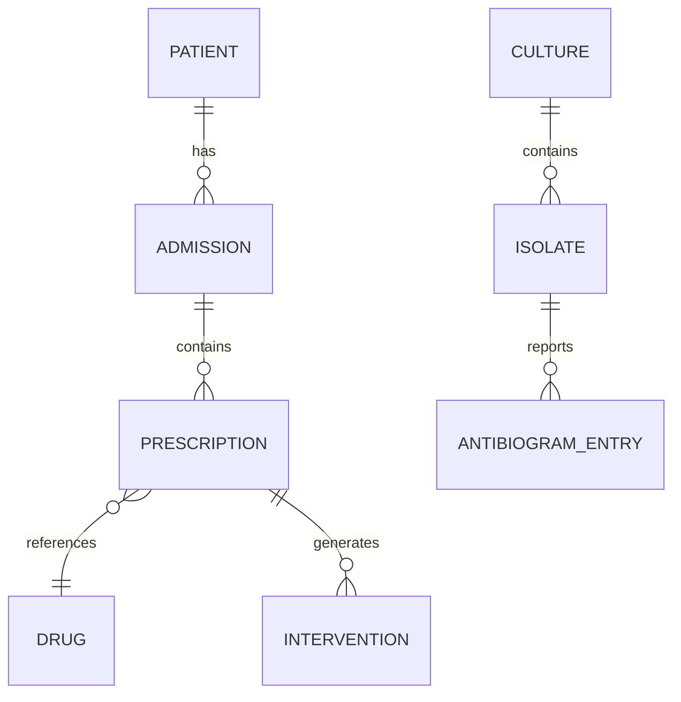

<p align="center">
  
</p>

<h1 align="center">Antimicrobial Stewardship Tracker</h1>

<p align="center"><em>Guideline-driven antimicrobial review, culture-driven drug–bug mismatch alerts, time-boxed pre-authorization, and utilization analytics — hospital-grade stewardship with auditability.</em></p>

<p align="center">
  <!-- Generic, non-repo-specific badges -->
  
  
  
  
</p>

---

One-sentence problem → solution

- Problem: Antimicrobial misuse and delayed de-escalation drive antimicrobial resistance and poor outcomes.
- Solution: A production-minded stewardship platform that automates review triggers, proposes pharmacist interventions, surfaces culture-driven drug–bug mismatches, enforces restricted-drug pre-authorization, and reports utilization metrics (DOT, DDD, antibiograms).

Key capabilities:
- Rule engine: IV→PO eligibility, renal dose adjustments (Cockcroft–Gault), MAX_DURATION, redundant coverage detection.
- Culture pipeline: first-isolate dedup + drug–bug mismatch auto-task creation and de-escalation suggestions.
- Prescription lifecycle: propose → accept/reject (mandatory rejection reason), restricted-drug PENDING→APPROVED→ACTIVE.
- Metrics & reporting: DOT, DOT/1000 patient-days, DDD, CLSI-style antibiogram gating.

## Quick highlights

- Production-grade modular monolith: Java 21, Spring Boot 3.5, virtual threads.
- Event-driven flows: RabbitMQ in local/production; in-process bus for dev.
- Security: stateless JWT, Argon2id password hashing (dev HS256 IdP), RBAC + method security, PHI masking.
- Observability: Prometheus metrics, Grafana dashboards, health & actuator endpoints.
- CI: Testcontainers for integration tests (Postgres), static analysis (Checkstyle, SpotBugs) in CI.

---

## Architecture (at-a-glance)

```mermaid
flowchart LR
  subgraph Ingress
    A[EMR / Order API] -->|POST Rx| API[Stewardship API]
  end

  subgraph App["Application (Spring Boot)"]
    API --> RE[Rule Engine]
    API --> QS[Review Task Scheduler]
    API --> IU[Interventions Service]
    RE --> Events[(Event Bus)]
    QS --> Events
    IU --> Events
  end

  subgraph Data["Data & Services"]
    Events --> MQ[RabbitMQ (DLX)]
    MQ --> Worker[Background Worker]
    Worker --> DB[(Postgres)]
    DB --> AB[Antibiogram]
  end

  subgraph Observability
    App --> Prom[Prometheus]
    Prom --> Graf[Grafana]
  end
```

- The diagram is intentionally focused: API entry → rule engine / scheduler / intervention flow → event bus → background processing → Postgres (analytical models such as antibiogram). RabbitMQ/DLX used in local/production profile, in-process bus for dev.

## Request / evaluation sequence (example)



## Database ER (simplified)



---

## Verification & status

| Gate | Result |
|---|---|
| mvn verify — unit/IT/security (Testcontainers PG) | ✅ 0 failures |
| mvn verify -Pstatic-analysis (Checkstyle + SpotBugs) | ✅ 0 violations |
| Live clinical smoke tests | ✅ 8 scenarios verified |

Feature status (high level):

| Feature | Status |
|---|---|
| Rule engine (IV→PO, renal, redundancy) | Production-ready |
| Culture-driven mismatch tasks | Production-ready |
| Restricted drug pre-auth workflow | Production-ready |
| DOT/DDD analytics + antibiogram gating | Production-ready |
| PHI masking & audit log | Production-ready |

---

## Technology

| Layer | Technology |
|---|---|
| Language | Java 21 |
| Framework | Spring Boot 3.5 |
| Build | Maven 3.9+ |
| DB | PostgreSQL 16 |
| Queue | RabbitMQ (production), in-process bus (dev) |
| Container | Docker Compose for local prod-like stack |
| Metrics | Prometheus + Grafana |
| Security | JWT, Argon2id, RBAC, method security |

---

## Local quickstart (zero dependencies)

Prerequisites:
- JDK 21+
- Maven 3.9+

Run in dev profile (in-process event bus, seeded demo data):

```bash
# From project root (projects/java-211)
mvn -DskipTests package
java -jar target/antimicrobial-stewardship-1.0.0.jar --spring.profiles.active=dev
# or with maven plugin
mvn spring-boot:run -Dspring-boot.run.profiles=dev
```

Endpoints:
- Swagger UI: http://localhost:8080/swagger-ui.html
- Actuator health: http://localhost:8080/actuator/health

Demo credentials (dev seed):
| User | Role | Password |
|---|---:|---|
| pharmacist | PHARMACIST | Password123! |
| prescriber | PRESCRIBER | Password123! |
| idphysician | ID_PHYSICIAN | Password123! |
| microbiologist | MICROBIOLOGIST | Password123! |
| infectioncontrol | INFECTION_CONTROL | Password123! |
| admin | STEWARDSHIP_ADMIN | Password123! |

Example workflow (token + evaluate):

```bash
TOKEN=$(curl -s -X POST http://localhost:8080/api/v1/auth/token \
  -H "Content-Type: application/json" \
  -d '{"username":"pharmacist","password":"Password123!"}' | jq -r .accessToken)

# Evaluate a prescription (replace <RX_ID>)
curl -s http://localhost:8080/api/v1/stewardship/evaluate/<RX_ID> \
  -H "Authorization: Bearer $TOKEN" | jq
```

For a production-like local stack (Postgres, RabbitMQ, Prometheus, Grafana):

```bash
cp .env.example .env
docker compose up --build
```

---

## Security summary

- Stateless JWT tokens (dev: HS256 local IdP; production: OIDC-ready).
- Passwords Argon2id hashed. Account lockout + rate-limited auth.
- RBAC + method-level authorization: pharmacist → propose; prescriber → accept/reject; ID physician → authorize restricted drugs; infection control → read-only analytics.
- PHI masking at API boundary; clinical audit log with correlation IDs and RFC7807 error responses.
- Threat model in docs/SECURITY.md.

---

## Metrics & operations

- Metrics exposed for Prometheus at /actuator/prometheus.
- Example utilization metrics endpoint:

```bash
curl -s "http://localhost:8080/api/v1/metrics/utilization?from=2026-08-01T00:00:00Z&to=2026-08-19T00:00:00Z" \
  -H "Authorization: Bearer $TOKEN" | jq
```

- Logs: structured JSON; correlation id propagated across async flows via message headers.

---

## Testing

- Unit & integration tests use JUnit + Testcontainers (Postgres).
- Static analysis profile (Checkstyle + SpotBugs) available: `mvn verify -Pstatic-analysis`.

<details>
<summary>CI / Test notes (expand)</summary>

- Integration tests run against ephemeral Postgres via Testcontainers to validate DB migration and rule engine behavior.
- Security tests assert RBAC and PHI masking behavior; sample credentials are seeded only in `dev`.
- To run tests locally:
  ```bash
  mvn -DskipITs=false test
  ```
</details>

---

## Developer reference

<details>
<summary>API reference (expand)</summary>

Key endpoints (high-level):
- POST /api/v1/auth/token — obtain JWT (dev seed user)
- GET /api/v1/stewardship/evaluate/{rxId} — evaluate a prescription against rules
- POST /api/v1/interventions — propose an intervention
- PATCH /api/v1/interventions/{id}/accept — prescriber accepts intervention
- GET /api/v1/metrics/utilization — DOT/DDD utilization metrics
- GET /api/v1/antibiogram — aggregated antibiogram (first-isolate dedup, 30-isolate gate)

For full swagger docs, use /swagger-ui.html while app is running.
</details>

<details>
<summary>Configuration reference (expand)</summary>

- Profiles:
  - dev: in-process event bus, H2 or dev Postgres, seeded data
  - local: docker compose Postgres + RabbitMQ
  - prod: external RabbitMQ, managed Postgres, OIDC
- Environment variables: see .env.example
</details>

---

## Architecture deep-dive (recommended reading)

- docs/ARCHITECTURE.md — component responsibilities, rule engine internals, event contracts.
- docs/SECURITY.md — threat model, OWASP mapping, PHI handling.
- docs/OPERATIONS.md — deployment and runbooks for RabbitMQ, Prometheus, Grafana.

---

## Roadmap (short)

- Add ML-driven de-escalation ranking (priority suggestions).
- Cross-facility antibiogram aggregation with de-dup strategies.
- HL7 FHIR ingestion connector (orders & results).
- RBAC policy engine migration to external PDP for complex constraints.

---

If you'd like, I can:
- commit this README.md into projects/java-211 on the repository,
- or produce a separate, condensed README suitable for the repo root.

What would you like me to do next?
