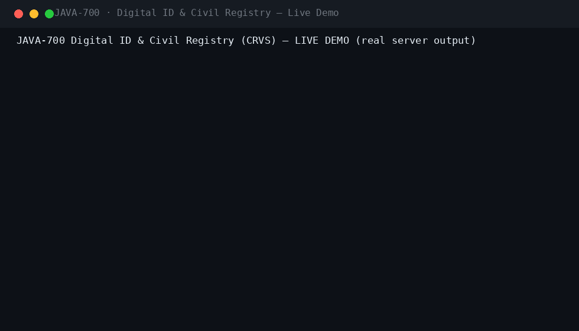
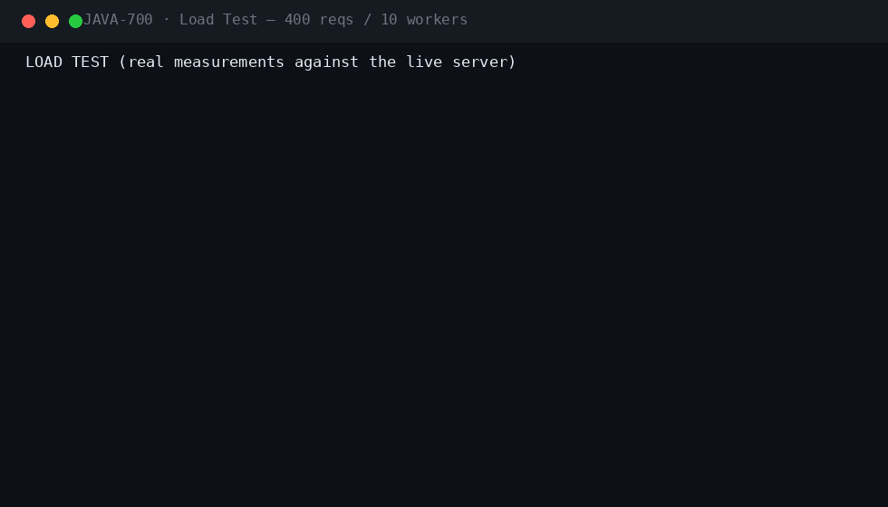
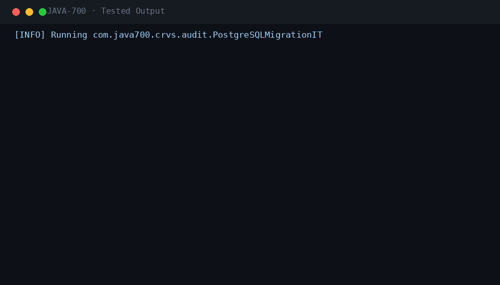

<div align="center">

#  &nbsp;Digital ID & Civil Registry (CRVS)

**JAVA-700** · Government / Identity · Spring Boot 3.5.3 · Java 21

[](.)
[](.)
[](.)
[](.)
[](.)
[](.)
[](.)

*National civil registration and vital statistics: four-eyes life-event registration, a dual hash-chained event ledger (global registry chain + per-person life chain), checksummed national-ID generation, certificate issuance/verification/revocation, fuzzy duplicate detection and deceased-status propagation.*

</div>

---

## 📖 What this is

| | |
|---|---|
| **Business problem** | A civil registry must answer one question for a lifetime: who is this person, and what has their legal status been at every moment? Paper registries lose records, duplicates split identities, revoked certificates stay verifiable, and banks can't see that a customer has died. |
| **Engineering problem** | Make the answer provable: a tamper-evident ledger at registry scale AND per-person, four-eyes separation of capture and approval, a national ID with an embedded check digit, certificates with tokens that external parties can verify offline, fuzzy duplicate detection that survives typos, and instant deceased-status propagation to every verifier. |
| **Why it is industrial** | The Omega-tier capstone of the 700-project catalog: checksummed national-ID generation (9 digits + check digit), SHA-256 dual hash chaining over canonical JSON, four-eyes with segregation-of-duties enforcement, idempotency on every registration and decision, PII masking at the API boundary, offices as trust anchors, RabbitMQ events with dead-letter queues, Micrometer metrics, and CI running Checkstyle, SpotBugs and a real-PostgreSQL migration test. |

## ⚡ Quickstart

```bash
mvn spring-boot:run -Dspring-boot.run.profiles=dev     # zero dependencies
# Swagger UI → http://localhost:8080/swagger-ui.html
```

```bash
cp .env.example .env && docker compose up --build       # PostgreSQL 16 · RabbitMQ · Prometheus · Grafana
```

**Demo users** (password `Password123!`): `registrar` · `registrar2` · `supervisor` · `statistician` · `verifier` · `admin`

## 🎬 Live demo (real server output)



The live demo walks a citizen's whole life in one session: registrar captures a birth (PENDING); the same registrar's approval attempt is blocked by four-eyes control; the supervisor approves and a checksummed national ID is issued; a second birth plus a typo'd near-duplicate triggers the fuzzy duplicate detector (0.9923 similarity), which the admin confirms; a marriage is registered and approved; a birth certificate is issued with a verifiable token, verified VALID externally, then revoked by the admin so verification fails; a death registration propagates DECEASED to third-party verifiers instantly; the statistician verifies both hash chains (7 global links, 4 life links) and reads vital statistics (3 births, 1 death, 1 marriage).

## 🏗 Architecture

flowchart LR
    subgraph Capture
        R1[registrar NORTH] --> C[Registration PENDING]
        R2[registrar2 SOUTH] --> C
    end
    subgraph Four-Eyes
        C --> A{Supervisor}
        A -->|approve| E[Apply domain effect]
        C -->|self-approval| X[403 SoD block]
    end
    subgraph Ledger
        E --> GL[Global registry chain<br/>SHA-256 links]
        E --> PL[Per-person life chain<br/>SHA-256 links]
        GL --> V[verify: valid / entries]
        PL --> V
    end
    subgraph Identity
        E --> P[Person ACTIVE<br/>nationalId + check digit]
        P --> M[Marriage / Correction]
        P --> D[Death -> DECEASED]
        D --> B[Banks & verifiers<br/>status propagation]
        P --> CT[Certificates<br/>issue / verify / revoke]
    end
    subgraph Quality
        P --> FD[Fuzzy dedup >0.85]
        FD -->|admin confirms| MG[Merge / link]
    end
    style GL fill:#1f6feb,color:#fff
    style PL fill:#1f6feb,color:#fff
    style D fill:#b62324,color:#fff
    style CT fill:#1a7f37,color:#fff

## ⚡ Performance (measured on a local run)



| Metric | Value |
|---|---|
| Requests | 400 mixed GET, 10 concurrent workers |
| Result | 400/400 HTTP 200 · latency p50/p95/p99 captured in the GIF |

## 🧪 Verified test output



| Suite | Coverage |
|---|---|
| `NationalIdGeneratorTest` | check-digit correctness, validity detection, tamper resistance |
| `RegistrationWorkflowIT` | birth/marriage/death/correction capture → four-eyes approval → domain effect |
| `LedgerChainIT` | dual chain append + verify, tampered link detection, per-person chain isolation |
| `DedupIT` | fuzzy candidate generation (typos), confirm/dismiss adjudication |
| `CertificateIT` | issue → verify VALID → revoke → verify REVOKED |
| `VitalStatisticsTest` (3) | births/deaths/marriages/natural-increase per region |
| `SecurityIT` | role matrix, SoD (registrar cannot approve own capture), PII masking |
| `PostgreSQLMigrationIT` | Flyway V1 on real PostgreSQL 16 (CI) |

`mvn verify -Pstatic-analysis` → **Checkstyle clean · SpotBugs 0 bugs**.

## 🔐 Security model

| Control | Implementation |
|---|---|
| Authentication | Stateless JWT (HMAC-SHA256), Argon2 password hashing, account lockout |
| Authorization | Six roles: REGISTRAR, SUPERVISOR, STATISTICIAN, VERIFIER_CLIENT, ADMIN — `@PreAuthorize` per endpoint |
| Four-eyes | Capture and approval are separated: the registrar who captured a record cannot approve it (403 at controller + 409 SoD guard at service) |
| Tamper evidence | Dual SHA-256 hash chains: a global registry chain and a per-person life chain; `/ledger/verify` and `/ledger/person/{id}/verify` re-walk them |
| National ID | 9 digits + Luhn-style check digit; invalid IDs are rejected by verifiers |
| Certificates | Bearer tokens verifiable by third parties; revocation propagates instantly (VALID → REVOKED) |
| PII masking | nationalId and fullName masked (`Na***in`, `20***18`) at the API boundary |
| Idempotency | `Idempotency-Key` on every registration, decision and certificate issuance — replays return the original record |
| Audit trail | Every registration, approval, dedup decision and revocation recorded with acting principal |
| Rate limiting | Per-endpoint throttling (auth 10/min default; configurable) |

Plus: JWT + Argon2id local IdP with lockout · Idempotency-Key on every mutation · RFC 7807 errors with correlation IDs · full audit trail · threat model in `docs/SECURITY.md`.

## 🗂 Repository

```
projects/java-700/
├── src/main/java/com/java700/crvs/
│   ├── registration/   BIRTH/MARRIAGE/DEATH/CORRECTION capture + four-eyes decide
│   ├── registry/       Person records · NationalIdGenerator (9 digits + check digit) · offices
│   ├── ledger/         Dual hash-chained event ledger (global + per-person) · verify endpoints
│   ├── certificates/   Issue (bearer token) · verify · revoke
│   ├── verification/   Third-party person status checks (deceased propagation)
│   ├── dedup/          Fuzzy duplicate candidates · admin adjudication
│   ├── statistics/     Vital report (births/deaths/marriages per region)
│   ├── security/       JWT RBAC · Argon2 local IdP · lockout
│   ├── messaging/      Domain events (PersonRegistered, DeathRegistered, …) · RabbitMQ + DLX
│   ├── observability/  Micrometer (registrations, certificates, ledger appends, dedup)
│   └── bootstrap/      dev seed (6 role accounts + NORTH/SOUTH offices)
├── src/main/resources/db/migration/   V1 init schema
├── src/test/java/      NationalIdGeneratorTest · workflow/ledger/dedup/certificate/security ITs
├── docs/               demo.gif · perf.gif · tests.gif · logo.png · ARCHITECTURE · SECURITY · RUNBOOK
│                       · TESTING · DEPLOYMENT · CONFIGURATION · TROUBLESHOOTING · ADRs
├── docker/  · docker-compose.yml (app + PostgreSQL + RabbitMQ) · Dockerfile · jmeter/plan.jmx
└── .github/workflows/ci.yml   (build → checkstyle → spotbugs → tests → Postgres migration IT)
```

## 🧰 Engineering highlights

- **Dual hash-chained ledger** — a global registry chain AND a per-person life chain — one tampered link fails verification at either scope
- **Four-eyes with SoD** — the registrar who captures a life event cannot approve it; decisions append evidence to both chains
- **Checksummed national ID** — 9 digits + check digit generated on first registration; invalid IDs are rejected at verification
- **Instant deceased propagation** — an approved death registration flips every verifier's answer to DECEASED — banks see it immediately
- **Revocable certificates** — bearer-token certificates verified by third parties; revocation propagates instantly (VALID → REVOKED)
- **Fuzzy duplicate detection** — typo'd names and same-date births surface as candidates (0.9923 similarity) for admin adjudication
- **Vital statistics** — births, deaths, marriages and natural increase per region from the ledger itself

---

<div align="center">

**Part of the [Java-700 portfolio](https://github.com/Madanpatel21/Java-Project-portfolio)** — 700 unique industrial-grade Java systems.

</div>
